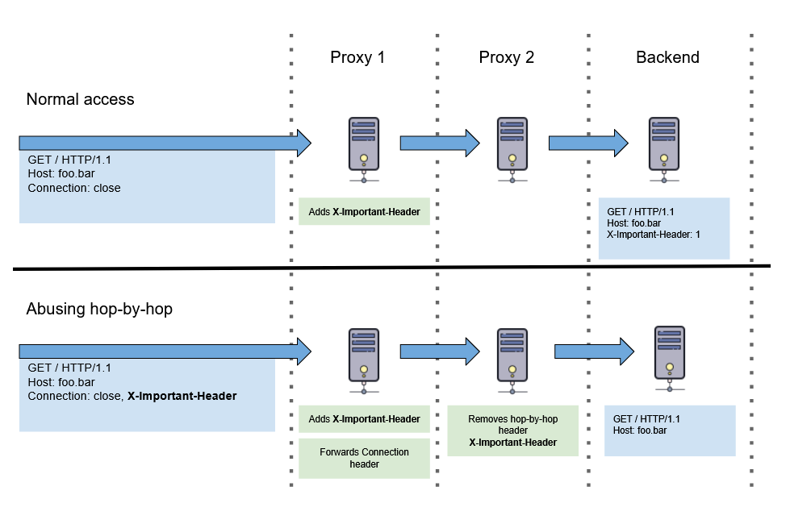

# hop-by-hop 请求头相关知识

# 0x01 什么是 hop-by-hop

- **定义：** 根据 [RFC 2612 Section 13.5.1](https://datatracker.ietf.org/doc/html/rfc2616#section-13.5.1)，HTTP/1.1 规范默认将以下请求头视为 hop-by-hop 请求头：`Keep-Alive`、`Transfer-Encoding`、`TE`、`Connection`、`Trailer`、`Upgrade`、`Proxy-Authorization` 和 `Proxy-Authenticate`。当代理服务器在请求中遇到这些请求头时，会对其进行处理，且不会将其转发至下一跳节点。

除了这些默认请求头外，用户也可自定义逐跳请求头。方法是[将请求头的键（key）添加到 `Connection` 请求头的值（value）中](https://datatracker.ietf.org/doc/html/rfc2616#section-14.10)，例如：

```http
Connection: close, X-Foo, X-Bar
```

以上代码表示，我们要求代理服务器将 `X-Foo` 和 `X-Bar` 视为 hop-by-hop 请求头，这意味着代理在将请求转发至下一跳之前，会处理并删除这两个请求头。

# 0x02 关于滥用 hop-by-hop 请求头的一些理论

直接删除某些请求头不一定会导致问题。但若能删除一个由前端或 HTTP 请求链中其他代理添加的、原始请求中不存在的请求头，则可能造成不可预测的后果。

例如，在一条 HTTP 请求链中，某代理服务器可能在请求包中插入一个请求头，该请求头可能涉及后端访问控制策略或描述互联网用户的真实地址。若该请求头缺失，可能导致应用程序处理逻辑出错，并输出大量调试错误信息。当前端代理存在转发 hop-by-hop 请求头列表的行为，而非按规定处理这些请求头时，就可能产生问题。因为它添加到请求中的任何请求头，都可能被下一跳（next hop）删除。

前文提及，`Connection` 请求头本身就是一个 hop-by-hop 请求头。这意味着一个符合规范的代理服务器在转发请求时，应按照 `Connection` 请求头中自定义的 hop-by-hop 请求头列表，删除相应的请求头，而不应将此自定义列表通过 `Connection` 请求头转发给下一台服务器。然而研究表明，实际情况可能并不总是符合预期。某些系统似乎会转发整个 `Connection` 请求头，或复制 hop-by-hop 列表并将其附加到自己的 `Connection` 请求头中。

下图展示了 hop-by-hop 请求头可能引发的问题场景，假设后端期望 `X-Important-Header` 并将其纳入逻辑决策：



# 0x03 如何发现系统中是否存在 hop-by-hop 请求头问题

一种简易测试方法是利用请求头出现与否会在响应中产生明显差异的特性，例如 Cookie。我们可以将这样一个请求头作为 hop-by-hop 请求头添加到 `Connection` 请求头中。如果请求链中的某个代理符合规范，会删除该 hop-by-hop 请求头，那么当此请求头同时出现在请求和 `Connection` 请求头列表中时，其响应应与该请求头完全不出现在请求中时相同，而与它仅出现在请求中、且不作为逐跳请求头列出时的响应不同。

以 Cookie 为例。携带认证 Cookie（如 `Cookie: session=admin`）访问受保护接口 `api/me` 时，服务器可能返回 `HTTP 200`；未认证访问则可能返回 `HTTP 302`。测试流程如下：

- 认证访问，返回 `HTTP 200`

```http
GET /api/me HTTP/1.1
Host: foo.bar
Cookie: session=admin
Connection: close
```

- 未认证访问，返回 `HTTP 302`

```http
GET /api/me HTTP/1.1
Host: foo.bar
Connection: close
```

- 系统中存在合规代理，代理按规范删除 Cookie 请求头，相当于未认证访问，返回 `HTTP 302`

```http
GET /api/me HTTP/1.1
Host: foo.bar
Cookie: session=admin
Connection: close, Cookie
```

通常可使用自动化工具进行测试，例如使用 Burp Suite 的 Intruder 功能并加载[预置的请求头字典](https://github.com/danielmiessler/SecLists/tree/master/Discovery/Web-Content/BurpSuite-ParamMiner)进行探测。

# 0x04 如何滥用 hop-by-hop 请求头

## 4.1 通过隐藏 X-Forwarded-For 来屏蔽原始 IP 地址

假设场景：前端代理接收用户请求后，会将用户真实 IP 地址添加到 `X-Forwarded-For` (XFF) 请求头中，后端的基础设施与应用程序据此识别用户真实 IP。若系统中存在一个符合规范的代理，当我们将 `X-Forwarded-For` 作为自定义 hop-by-hop 请求头时（即在请求中添加 `Connection: close, X-Forwarded-For`），则后端可能无法接收到用户真实 IP 地址（原因可能是收不到 XFF 头，或收到的 XFF 头值为前端代理的 IP 地址。例如 CloudFoundry 中的 gorouter，在转发请求前若请求中不存在 XFF 头，则会将其前一个设备的 IP 地址设为 XFF 值）。

仅隐藏真实 IP 地址似乎作用有限，但如果系统中存在以下情况，则可能触发访问控制绕过漏洞：

1. 应用系统链：**代理A (IP: 10.1.10.1)** -> **代理B (IP: 10.1.10.2)** -> **后端应用C (IP: 10.1.10.3)** 。
2. 后端应用C 的 `/admin` 路径设有访问控制逻辑：当访问 IP 为 `10.1.10.0/24` 网段时，直接放行。
3. 代理A 会自动添加 XFF 头以记录用户真实 IP。即使尝试传统的 `X-Forwarded-For` 欺骗，代理A 仍会将真实的原始 IP 附加到该请求头，使其形如 `X-Forwarded-For: <攻击者伪造 IP>, <攻击者真实 IP>`，因此应用程序可安全处理欺骗尝试。同时，代理A 仅仅转发 hop-by-hop 请求头列表，而不对其进行任何处理。
4. 符合规范的代理B 接收到代理A 的请求包后，会对 hop-by-hop 请求头列表进行处理。
5. 后端应用C 接收到代理B 转发的请求包，发现没有 XFF 头后，自动为请求包添加 XFF 头，其值为代理B 的 IP 地址。

因此，当攻击者发送一个包含 `Connection: close, X-Forwarded-For` 的请求时，代理B 将删除请求中的 `X-Forwarded-For` 头。结合上述第5点，攻击者即可直接访问 `/admin` 路径。类似案例可参考 [RITSEC-CTF-2019-hop-by-hop](https://github.com/ritsec/RITSEC-CTF-2019/tree/master/Web/hop-by-hop)。

```python
@base_app.route("/admin", methods=["GET"])
def verify():
    allowed_ips = ["direct", "8.8.8.8", "1.1.1.1"]
    try:
        source_ip = request.headers["X-Forwarded-For"]
    except KeyError:
        source_ip = "direct"
    if source_ip not in allowed_ips:
        return render_template("bad.html", ip_addr=source_ip)
    return render_template("admin.html")
```

在此 `verify` 函数中，代码尝试获取 XFF 头，若获取失败则默认值为 "direct"。前置服务为 Apache 时，根据逐跳原则，当 `Connection` 中标明 `X-Forwarded-For` 为逐跳请求头，Apache 在转发给下一跳时会移除 `X-Forwarded-For` 头，导致 `request.headers['X-Forwarded-For']` 抛出异常，从而绕过 IP 检查。

## 4.2 指纹服务

利用该技术删除特定请求头可能触发错误报告。根据特定的错误信息差异，可作为指纹识别手段。

## 4.3 关于《Abusing HTTP hop-by-hop request headers》一文中 SSRF 的说明

[文中](https://nathandavison.com/blog/abusing-http-hop-by-hop-request-headers)的观点如下：SSRF（Server-Side Request Forgery，服务器端请求伪造）漏洞允许攻击者诱导服务器发起请求（如 HTTP、FTP 等）。如果攻击者在 SSRF 利用过程中还能控制服务器发起请求时的请求头，则或许可结合 hop-by-hop 攻击进行组合利用。

# 0x05 其他

## 5.1 关于 hop-by-hop 的漏洞

- CVE-2022-1388

## 5.2 hop-by-hop 的适用面

根据其他安全研究员的测试，Apache、Nginx、OpenResty、HAProxy 等组件中，仅 Apache 会按规范消费掉 `Connection` 中指定的逐跳请求头，其他组件需单独测试确认。

# 0x06 参考

- https://paper.seebug.org/1908/#hop-by-hop_1
- https://nathandavison.com/blog/abusing-http-hop-by-hop-request-headers