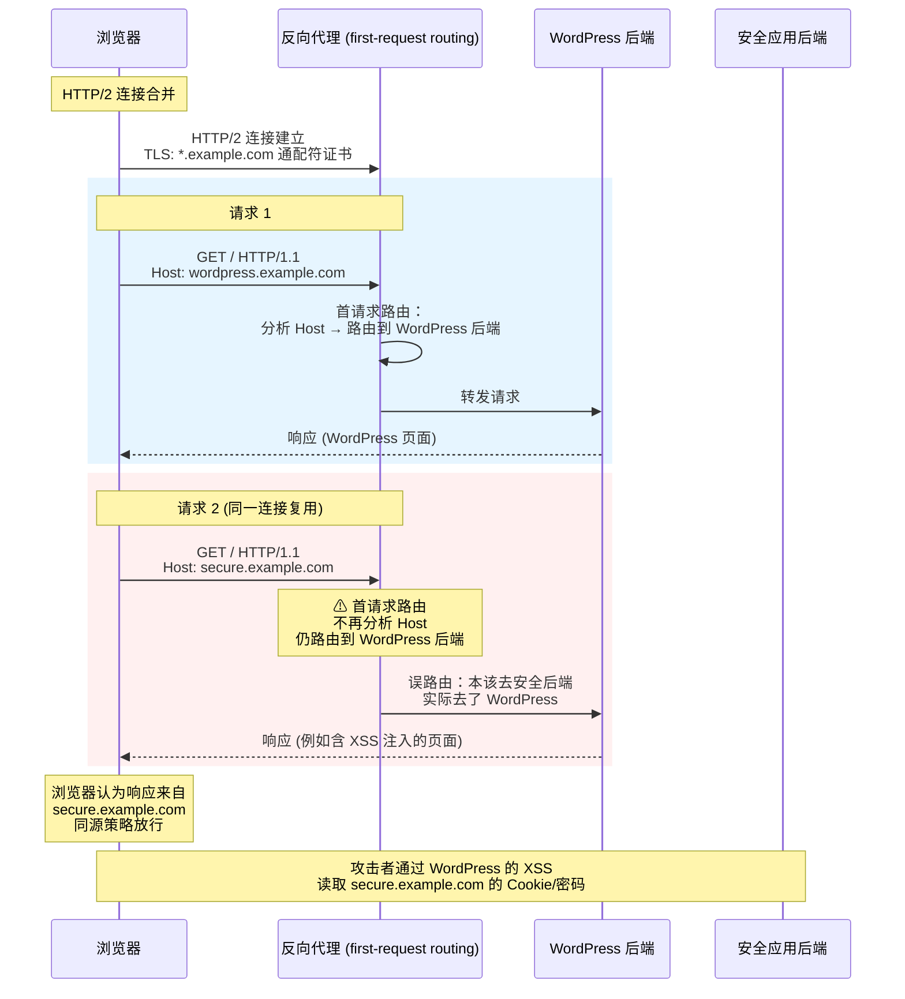

---
attack_surface:
  - 协议解析差异
  - 缓存/代理逻辑
  - 配置缺陷
impact:
  - 客户端利用
  - 信息泄露
  - 身份伪造
risk_level: 中
prerequisites:
  - HTTP/2 连接复用与多路复用
  - 反向代理与 TLS 证书
  - Web 浏览器同源策略
related_techniques:
  - host-header-attack
  - xss
  - http-request-smuggling
  - wildcard-certificate-abuse
difficulty: 高级
tools:
  - chrome-devtools
  - wireshark
  - http-request-smuggler
---

# HTTP Connection Contamination — HTTP 连接污染攻击

> 关联文档：[HTTP Request Smuggling](../HTTP%20Request%20Smuggling/README.md) · [Abusing Hop-by-Hop Headers](../Abusing%20hop-by-hop%20headers/README.md) · [Special HTTP Headers](../../Web%20Servers%20&%20Middleware/Special%20HTTP%20Headers/README.md) · [Cache Poisoning&Cache Deception](../Cache%20Poisoning%26Cache%20Deception/README.md)

---

### 知识路径

```
HTTP Connection Contamination（本文档）
  ├── 前置知识：HTTP/2 连接复用 (Multiplexing) 与连接合并 (Coalescing)
  ├── 前置知识：反向代理 first-request routing 行为
  ├── 进阶：HTTP/3 移除 IP 匹配要求 → 攻击面扩大
  ├── 关联：HTTP Request Smuggling — 同为反向代理请求路由混淆
  │   └── 参见：Proxies/HTTP Request Smuggling
  ├── 关联：Host Header Attacks — first-request routing 本质是 Host 头路由
  └── 关联：Wildcard TLS 证书滥用
```

---

# 0x01 原理

## 1.1 两个特性的冲突

HTTP Connection Contamination 是两个独立特性**碰撞**产生的结果：

**浏览器侧：HTTP Connection Coalescing（连接合并）**

浏览器可以将发往**不同网站**的请求复用到**同一条 HTTP/2（或 HTTP/3）连接**上，前提是：
- 两个域名解析到**同一个 IP 地址**
- 服务器持有对两个域名都有效的 **TLS 证书**（通配符证书最常见：`*.example.com`）

这是浏览器的性能优化——不必为每个子域名建立新的 TLS 连接。

**代理侧：First-Request Routing（首请求路由）**

某些反向代理在处理连接时，分析该连接上的**第一个请求**来决定路由到哪个后端，然后**该连接上的所有后续请求**都被路由到**同一个后端**，不再重新分析。

## 1.2 如何组合产生攻击

当以上两个特性叠加在同一基础设施上时：

1. 浏览器合并了 `wordpress.example.com` 和 `secure.example.com` 的连接（因为它们解析到同一个 IP，TLS 通配符证书对两者均有效）
2. 浏览器的第一个请求发往 `wordpress.example.com` → 反向代理将其路由到 WordPress 后端
3. 第二个请求（原计划发往 `secure.example.com`）在同一条连接上发出 → 由于首请求路由，**该请求被错误地发送到 WordPress 后端**
4. WordPress 后端处理了本该由 `secure.example.com` 处理的请求

**污染结果**：`secure.example.com` 的请求被错误路由到 WordPress 后端。如果 WordPress 存在 XSS，注入的恶意 JS 在浏览器看来**源自 `secure.example.com`**——同源策略完全信任它，攻击者可以访问 `secure.example.com` 下保存的密码、Cookie 和其他敏感数据。

## 1.3 完整攻击流程

```
攻击场景：
  - wordpress.example.com → 反向代理 → WordPress 后端
  - secure.example.com   → 同一反向代理 → 安全应用后端
  - TLS 通配符证书 *.example.com 对两者均有效

浏览器行为（攻击者诱导）：
  1. 浏览器先访问 wordpress.example.com
  2. 浏览器再访问 secure.example.com
  3. 连接合并：两个请求走同一 HTTP/2 连接

反向代理行为（first-request routing）：
  4. 第一个请求 wordpress.example.com → 路由到 WordPress 后端
  5. 第二个请求 secure.example.com → 仍被路由到 WordPress 后端（误路由）

攻击者利用：
  6. WordPress 存在 XSS  → 注入恶意 JS
  7. 浏览器认为 JS 来自 secure.example.com → 同源策略放行
  8. 攻击者读取 secure.example.com 下的 Cookie/密码/Token
```

## 1.4 流程图



---

# 0x02 攻击前置条件

| 条件 | 说明 |
|------|------|
| **反向代理使用 First-Request Routing** | 连接上的第一个请求决定后端，后续请求跟随 |
| **TLS 通配符证书（或多个 SAN 证书）** | 使浏览器将不同子域名合并到同一连接 |
| **目标子域名解析到同一 IP** | 浏览器连接合并的前提（HTTP/3 将移除此要求） |
| **其中一个子域名存在漏洞** | 如 XSS——攻击者可在其上注入恶意代码 |

---

# 0x03 检测方法

## 3.1 手动检测 First-Request Routing

在 Burp Repeater 中：
1. 启用 HTTP/1 和 HTTP/2 连接复用
2. 在同一连接上发送两个请求到不同子域名
3. 观察第二个请求是否被路由到了第一个请求的后端

也可使用 **HTTP Request Smuggler** 插件的 "Connection-State" 攻击模式自动扫描。

## 3.2 检测连接合并

在 Chrome DevTools 的 Network 标签中，使用 Timing 图表观察第二个请求是否显示了 "Initial connection" 耗时——如果没有，说明复用了已有连接。Connection ID 列会显示相同的 ID。

使用 `fetch()` 测试：

```javascript
fetch("//sub1.hackxor.net/", { mode: "no-cors", credentials: "include" }).then(
  () => {
    fetch("//sub2.hackxor.net/", { mode: "no-cors", credentials: "include" })
  }
)
```

或使用 Wireshark 捕获 TLS 握手，确认两个域名走同一个连接。

---

# 0x04 实际风险与未来趋势

## 4.1 当前限制

当前此威胁的实际利用面相对有限：

1. **First-Request Routing 相对少见**——多数反向代理（Nginx、HAProxy、Envoy）的默认行为是针对每个请求独立路由，而非按连接首请求
2. **HTTP/2 实现复杂度**——相对于 HTTP/1.1，HTTP/2 服务器池较小，降低了命中概率
3. **可能被意外修复**——使用 first-request routing 的 HTTP/2 服务器可能因连接合并对正常用户造成间歇性故障，运营方可能在攻击者发现前就修复了此配置

## 4.2 HTTP/3 的影响

HTTP/3 提议**移除 IP 地址匹配要求**进行连接合并——仅需 TLS 证书有效。这意味着：

- 使用通配符证书且存在 first-request routing 的所有服务器**无需 MITM** 即可被攻击
- 被入侵且持有通配符证书的服务器可被用于攻击**同证书覆盖的所有同级域名**
- 攻击面显著扩大——任何持有通配符证书的反向代理都潜在受影响

---

# 0x05 防御

| 措施 | 理由 |
|------|------|
| **避免使用 First-Request Routing** | 反向代理应对每个请求独立路由，不依赖连接上的首请求 |
| 限制通配符 TLS 证书的使用范围——仅对必需子域名签发 | 减少连接合并的潜在面 |
| 为不同安全级别的应用使用**不同的反向代理/后端集群** | 即使发生误路由，攻击也无法跨安全边界 |
| HTTP/3 部署前审计反向代理的路由策略 | HTTP/3 放宽 IP 匹配后，first-request routing 的风险急剧升高 |

## 参考资料

- [PortSwigger Research — HTTP/3 Connection Contamination: An Upcoming Threat?](https://portswigger.net/research/http-3-connection-contamination)
- [Daniel Haxx — HTTP/2 Connection Coalescing](https://daniel.haxx.se/blog/2016/08/18/http2-connection-coalescing)
