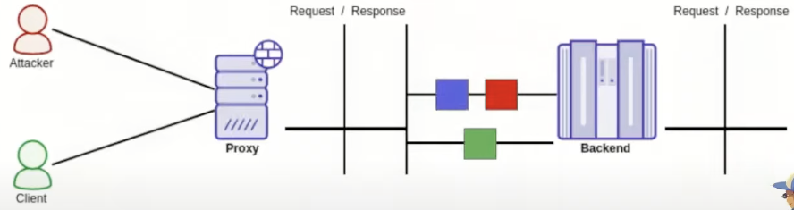
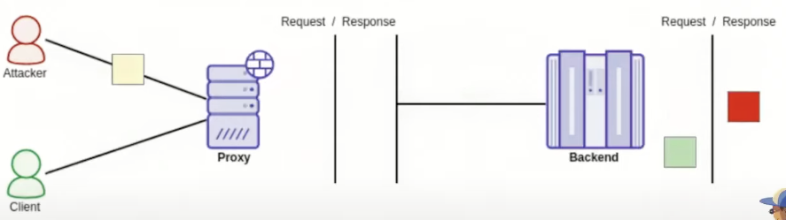
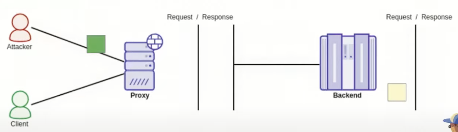
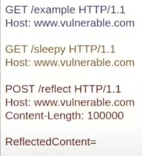
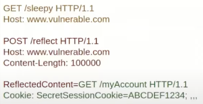
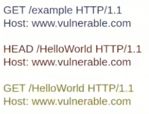
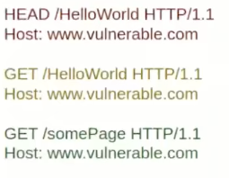
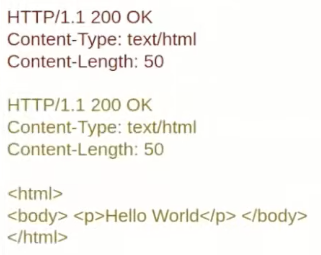
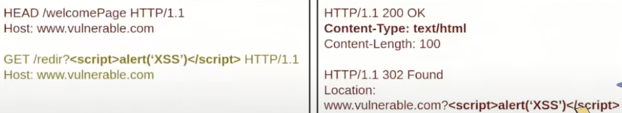

# HTTP Response Smuggling / Queue Desynchronization

# 0x01 核心原理：响应队列去同步 (Response Queue Desync)

在 HTTP/1.1 的管道化（Pipelining）或代理与后端之间的长连接（Keep-Alive）中，代理服务器必须严格匹配请求与响应的顺序。

**攻击逻辑：**

1. 攻击者利用请求走私在后端连接中注入 **2 个完整的请求**。
2. 代理服务器认为它只发送了 1 个请求，而后端实际上处理了 2 个并生成了 2 个响应。
3. 此时，代理的“请求-响应”匹配队列发生错位（Desync）。

------

# 0x02 关键挑战：异步时机 (The Timing Factor)

如果 smuggled 请求（被走私的请求）立即返回响应，代理会因为收到“多余”的响应而报错或直接丢弃。

- **解决办法**：使 Smuggled 请求成为一个**耗时操作（Sleepy Request）**。
- **效果**：当攻击者的初始连接关闭后，Smuggled 请求才处理完成。此时，受害者发起一个新请求，代理会将之前残留的 Smuggled 响应错误地分配给受害者。







------

# 0x03 攻击场景与利用

## 3.1 劫持受害者响应 (Stealing Responses)

- **目标**：获取受害者的 `Set-Cookie` 或敏感数据。

- **过程**：
  
  1. 攻击者发送：`合法请求` + `耗时请求` + `反射型 POST 请求（大 Content-Length）`。
  
     
  
  2. 受害者的请求被拼接到攻击者的 POST 请求体中，作为“数据”发送给后端。
  
     
  
  3. 攻击者随后发起新请求，获取那个包含受害者完整请求内容的响应。
  
  
  
  ```Mermaid
  sequenceDiagram
      autonumber
      participant A as 攻击者 (Attacker)
      participant V as 受害者 (Victim)
      participant P as 代理 (Proxy)
      participant B as 后端 (Backend)
  
      Note over A,B: 阶段 1: 攻击者发送复合 Payload
      A->>P: 1. [正常请求] + [耗时请求] + [大CL反射请求]
      P->>B: 转发上述三个请求
      B-->>P: 处理完 [正常请求]
      P-->>A: 返回 [正常响应]
  
      Note over A,B: 阶段 2: 关键窗口期 (后端正在处理耗时请求)
      V->>P: 2. [受害者的敏感请求]
      P->>B: 转发受害者请求
      Note right of B: 后端认为受害者的请求是[大CL反射请求]的 Body 内容！
      
      Note over A,B: 阶段 3: 响应错位 (Desync 发生)
      B-->>P: 处理完 [耗时请求] 的响应
      P-->>V: 3. 将 [耗时响应] 错误发给受害者 (受害者被干扰)
  
      Note over A,B: 阶段 4: 攻击者“取货”
      A->>P: 4. 发送一个普通的 [探测请求]
      B-->>P: 处理完 [吸纳了受害者数据的反射响应]
      P-->>A: 5. 将 [包含受害者数据的响应] 发给攻击者！！
  ```
  
  

## 3.2 HEAD 请求引起的响应混乱

- **原理**：根据规范，`HEAD` 请求的响应必须包含 `Content-Length` 但**不能有 Body**。

- **利用**：
  
  1. 攻击者走私一个 `HEAD` 请求。
  
     
  
  2. 代理收到响应头后，由于存在 `Content-Length` 但没有 Body，它会持续等待并“抓取”后端紧接着发出的下一个响应（即第二个 Smuggled 请求的响应）作为 `HEAD` 的 Body 发送给受害者。
  
  
  
  

## 3.3 内容混淆与 XSS (Content Confusion)

利用代理服务器对 `HEAD` 请求规范的死板执行，将一个**本不该被执行的重定向链接**，强行伪装成一个**合法的脚本页面**：

1. **HEAD /welcomePage**：目标是一个正常的、返回 `text/html` 且具有一定长度（如 `Content-Length: 100`）的页面。

2. **GET /redir?...**：目标是一个将输入参数反射在 `Location` 头部的重定向接口。

   

### 3.3.1 响应队列的“拼装”逻辑

当受害者请求到达时，代理服务器经历了以下逻辑转换：

- **步骤 A（代理收到第一个响应）**： 后端返回了 `HEAD` 的响应：`200 OK`, `Content-Type: text/html`, `Content-Length: 100`。 **重点**：根据协议，`HEAD` 响应没有 Body。代理服务器此时会认为：“我已经拿到了 200 OK 的头，但我还缺 100 字节的 HTML 内容，我得去连接池里接着读。”

- **步骤 B（代理错误地读取第二个响应作为 Body）**： 后端紧接着吐出了第二个请求的响应：`302 Found`, `Location: ...<script>alert(1)</script>`。 **重点**：代理服务器**不认为**这是一个新的响应，而是把它当成了刚才 `HEAD` 请求缺失的那 100 字节的 **Body**。

- **步骤 C（受害者的浏览器接收）**： 受害者最终收到的响应结构变成了：

  HTTP

  ```
  HTTP/1.1 200 OK
  Content-Type: text/html
  Content-Length: 100
  
  HTTP/1.1 302 Found
  Location: www.vulnerable.com?<script>alert('XSS')</script>
  ```

  对于浏览器来说，它看到的是一个正常的 `200 OK` 的 HTML 页面，而页面内容恰好包含了 `<script>` 标签。浏览器会毫不犹豫地解析并执行它。

## 3.4 响应拆分与完全伪造 (Response Splitting)

- **目标**：让代理向受害者发送一个 100% 由攻击者构造的 HTTP 响应。
- **条件**：需要找到一个能反射输入内容的端点，并精确计算 `HEAD` 响应的长度。
- **效果**：攻击者在响应队列中构造了一个完整的 `HTTP/1.1 200 OK ...` 报文，导致下一个受害者收到的完全是攻击者定义的页面。

------

# 0x04 高级缓存利用

| **技术方案**                           | **描述**                                                     |
| -------------------------------------- | ------------------------------------------------------------ |
| **缓存投毒 (Cache Poisoning)**         | 利用响应去同步，使代理缓存将恶意响应映射到任意 URL，后续所有访问该 URL 的用户都会中招。 |
| **网页缓存欺骗 (Web Cache Deception)** | 诱导代理将受害者的私有响应（如个人资料页）缓存到攻击者可访问的公共路径下。 |

------

# 0x05 总结：攻击组织结构

一个完整的 Response Smuggling 攻击负载通常由三部分组成：

1. **触发前缀**：利用 CL/TE 差异进入后端。
2. **耗时请求 (Sleepy)**：用于拉开时间差，确保攻击者能全身而退并让去同步生效。
3. **负载请求 (Payloads)**：一个或多个用于执行实际漏洞（如反射数据、伪造响应）的请求。

