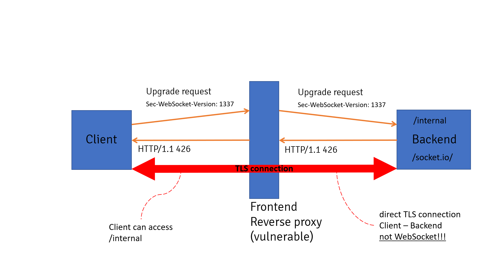
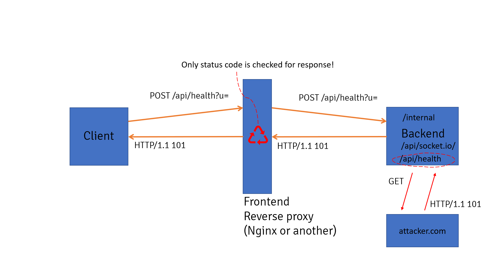
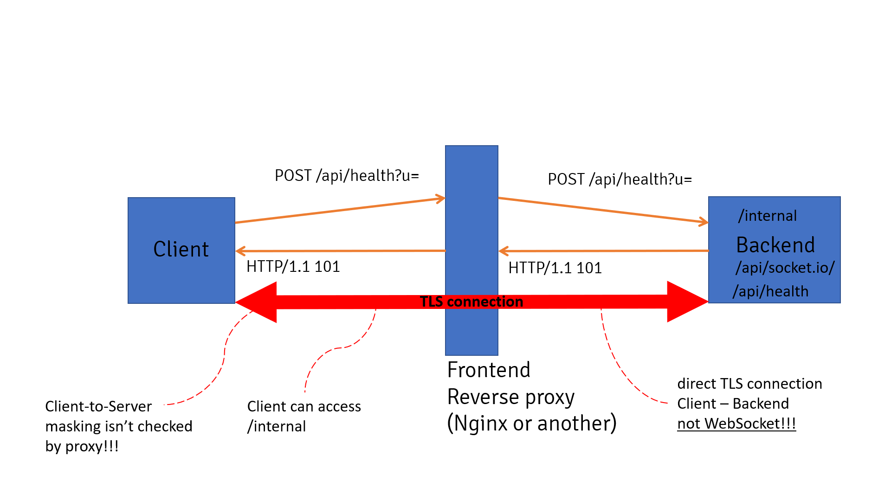

# Upgrade Header 走私 (H2C & WebSocket)

# 0x01 核心原理：协议切换的“信任陷阱”

**Upgrade Header 走私**利用了 HTTP 协议中**协议切换（Protocol Upgrade）**的机制。其核心在于诱导中间代理进入“隧道模式”，从而剥离其安全审计功能。

- **隧道模式（Tunneling）**：当代理认为协议已切换（如从 H1.1 切换到 WebSocket 或 H2C），它会从 **L7（应用层）检测**退化为 **L4（传输层）转发**。
- **认知偏差**：
  - **代理视角**：看到 `101 Switching Protocols` 响应后，认为后续流量是不可解析的二进制流，从而停止对请求路径（Path）、头部（Headers）和 WAF 规则的校验。
  - **攻击者与后端视角**：双方在“隧道”内通过预定的协议（如 H2 二进制帧）正常通信，直接绕过代理的 ACL 限制。
- **漏洞本质**：代理服务器在处理“协议切换”瞬间存在逻辑断层，未能严格校验切换状态的合法性。

------

# 0x02 H2C 走私 (HTTP/2 Over Cleartext)

H2C 是在没有 TLS 保护的情况下运行 HTTP/2 的实现，主要依赖 HTTP/1.1 的 `Upgrade` 机制进行协商。

## 2.1 攻击原理与过程

1. **初始伪装**：攻击者发送一个看似合法的 H1.1 请求（访问允许的路径，如 `/public`），并携带 H2C 升级头：

   HTTP

   ```
   GET /public HTTP/1.1
   Host: target.com
   Upgrade: h2c
   HTTP2-Settings: AAMAAABkAARAAAAAAAIAAAAA
   Connection: Upgrade, HTTP2-Settings
   ```

2. **触发盲转发**：若代理转发该头且后端返回 `101`，代理进入隧道模式。

3. **协议嫁接**：攻击者立即在同一 TCP 连接上发送 **HTTP/2 Binary Frames**。

4. **越权访问**：代理不解析 H2 帧，直接透传。攻击者在 H2 帧中请求受限路径（如 `:path: /admin`），后端正常响应。

## 2.2 为什么必须是 H2C 而非 H2？

- **H2 (HTTPS)**：通过 TLS 层的 **ALPN** 协商。代理作为 SSL 终端能深度解析 H2 帧，不存在“认知断层”。
- **H2C (HTTP)**：通过 **Upgrade** 协商。它利用了代理对“明文升级”处理不严的漏洞，人为制造了一个代理“看不懂”的流量真空区。

## 2.3 代理受影响情况

- **默认转发（高危）**：HAProxy, Traefik, Nuster。
- **需特殊配置（潜在风险）**：NGINX, Apache, AWS ALB, Envoy, Apache Traffic Server 等。
  - *注：即使代理尝试过滤 `HTTP2-Settings`，若后端实现不严，攻击者使用精简的 `Connection: Upgrade` 仍可能成功。*

## 2.4 工具

- `h2csmuggler` (by BishopFox)
- `h2csmuggler` (by assetnote)

------

# 0x03 WebSocket 走私

WebSocket 走私主要利用代理对 `101 Switching Protocols` 响应码校验不严的缺陷。

## 3.1 场景一：版本协商欺骗 (Sec-WebSocket-Version)

1. **构造错误版本**：发送非法版本号（如 `Sec-WebSocket-Version: 99`）。
2. **代理盲传**：代理透传该请求。
3. **握手失败但隧道开启**：后端因版本错误返回 `426 Upgrade Required`。若代理仅检查“响应存在”而未强制校验 `101` 状态码，它可能错误地开启隧道。
4. **结果**：攻击者在未成功的 WebSocket 连接中走私 H1.1 请求。



## 3.2 场景二：基于 SSRF 的状态码伪造 (101 Switching)

这是最隐蔽的攻击方式，利用 SSRF 伪造后端响应：

1. **请求升级**：发送带 `Upgrade: websocket` 的请求。
2. **诱导 SSRF**：利用后端接口（如 `/api/health?url=...`）访问攻击者控制的恶意服务器。
3. **伪造 101**：恶意服务器返回 `HTTP/1.1 101 Switching Protocols`。
4. **代理受骗**：代理看到“后端”传回了 `101` 码，认为握手完成，打开 TCP 隧道。
5. **结果**：攻击者通过该持久连接直接与后端通信，绕过所有前置安全策略。





------

# 0x04 检测与加固建议

## 4.1 检测要点 (Checklist)

- **H2C 变形探测**：尝试发送不合规的 `Connection: Upgrade`（排除了 `HTTP2-Settings`），测试后端是否强制遵守 RFC。
- **状态码容错测试**：针对 WebSocket，测试发送错误协议头后，代理在收到非 `101` 响应时是否仍会保持连接开启。
- **内网盲区扫描**：重点关注城市级系统中的微服务网关（如 Envoy/Traefik），它们默认开启 H2C 支持的概率极高。

## 4.2 防御策略

- **原子化状态校验**：代理服务器必须严格匹配 `101 Switching Protocols` 状态码，任何其他响应均不得切换至隧道模式。
- **Hop-by-hop 头部剥离**：严格遵守 RFC，在转发前重新处理 `Upgrade` 和 `Connection` 头部，防止非预期的协议升级透传。
- **禁用不必要的 H2C**：在后端应用服务器上，除非业务绝对需要，否则应关闭明文 H2C 支持。
- **深度包检测 (DPI)**：提升 WAF 能力，使其能够解析隧道内的 HTTP/2 二进制帧或 WebSocket 帧。

# 0x05 实验室

- https://github.com/0ang3el/websocket-smuggle.git

# 0x06 参考

- https://hacktricks.wiki/zh/pentesting-web/h2c-smuggling.html
  - https://blog.assetnote.io/2021/03/18/h2c-smuggling/
  - https://bishopfox.com/blog/h2c-smuggling-request
  - https://github.com/0ang3el/websocket-smuggle.git